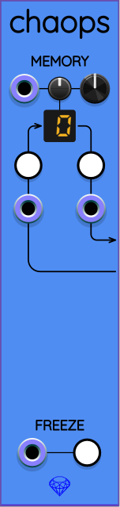

## Chaops

The name "Chaops" is an abbreviation of "chaos operators". Chaops is a left-expander module that provides extra functionality to the chaos modules [Frolic](Frolic.md), [Glee](Glee.md), and [Lark](Lark.md). When you place Chaops to the immediate left of a Frolic, Glee, or Lark chaos module, Chaops allows you to access additional functionality not available from outside that chaos module.

### Memory

The section labeled MEMORY allows you to select one of 16 memory cells with addresses numbered 0..15.

Immediately below the MEMORY label, from left to right, are a CV input port, a smaller attenuverter knob, and a larger manual selector knob. Turning the selector knob changes the active memory cell address, as reflected in the LED display.

You can automate selecting a memory cell by connecting an input cable to the memory CV input port and setting the attenuverter to a nonzero value. If you turn the attenuverter knob all the way clockwise to 100%, then each half volt (0.5&nbsp;V) increment of input voltage will increase the memory address by 1. Memory addresses are not clamped; instead, they wrap around. So by trying to go beyond address 15, you wrap back around to 0. Likewise, going below 0 will wrap around to 15.

Below the memory cell LED display are two buttons. The one on the left is labeled S, and the one on the right is labeled R. The S button stands for "store", and when pressed, causes the current state of the chaos module to the right to be stored inside the selected memory cell.

When you press the R button, which stands for "recall", the state of the chaos module is restored to the saved state from the selected memory cell.

Beneath the R and S buttons are corresponding trigger inputs that allow you to automate storing and recalling chaos states.

### Morph

The chaos modules all produce 3D vectors. Without Chaops, these 3D vectors are always position vectors in an abstract 3D space. The MORPH section in Chaops allows you to select position vectors, velocity vectors, or any linear combination between the two. By default, the larger knob on the right is set to 0, which keeps the existing position vector output behavior. When you turn the knob all the way clockwise to 1, the chaos module to the right of Chaops will output velocity vectors instead. Intermediate values between 0 and 1 output a linear weighted mix of position and velocity. The CV input port and attenuverter allow you to automate the morph mix between position and velocity. This feature provides another dimension of variability to produce novel chaotic signals.

### Freeze

At the bottom of the panel is a section labeled FREEZE. To the right is a button labeled F. When you press this button, it toggles whether the chaos module to the right updates the simulation with time or not. To the left is a gate input.

The button and gate input operate in combination with exclusive-or (XOR) logic. This means that if the freeze button is turned off, then the input gate must go high to freeze the module, or low to let it run. If the freeze button is turned on, then the input gate must go low to freeze the module, or high to let it run.
