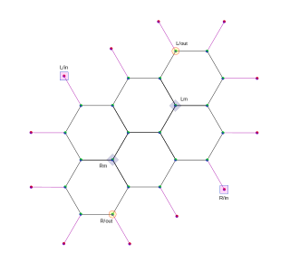
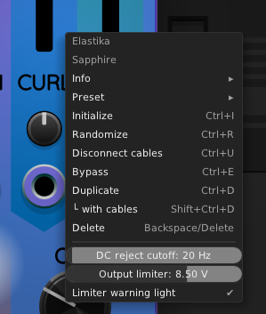
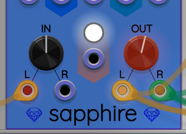

## Elastika

Elastika is a stereo synthesis filter based on a physics simulation.
There is a pair of left/right audio input jacks, and a pair of left/right
audio output jacks.

### Demo videos

Here are some videos that offer a peek at Elastika. Headphones are recommended to best experience the stereo field.

Omri Cohen made this "Quick Tip" video about using Elastika for metallic percussion sounds:

Here I demo feeding a simple square wave into Elastika to produce a gong-like sound:

In the next video, Seaside Modular's [Proteus](https://library.vcvrack.com/SeasideModular/Proteus) generates a melody that is fed through Elastika, producing a texture that starts out like a steel drum and ends up more like electric guitar distortion:

This video shows Elastika producing sounds on its own without any audio input. It is possible to tune it into self-oscillating modes that sound a little like a flute or recorder, then more like a trumpet. Parts of this recording are reminiscent of tuning a shortwave radio. Starting around 3:30 are some more chaotic and drone-like sounds.

Here is another example of a generated sound texture. Using Instruo ochd to slighly permute the settings, Elastika exhibits indefinite reverberation while subtly changing texture throughout.

Ambient musician [Virtual Modular](https://www.youtube.com/c/VirtualModular) created the following video where he combines Elastika with Infrasonic Audio's [Warp Core](https://library.vcvrack.com/InfrasonicAudio/WarpCore) oscillator to produce some really nice sound textures.

[Albert Yeh](https://www.youtube.com/user/papertigers4) created some fun polyrhythms fed through multiple instances of Elastika, used for percussion:

### Physics model

Understanding the inner workings of the simulation is
helpful for intuitively tuning Elastika's many control inputs.

The physics model includes a network of balls and springs connected in a hexagonal
grid pattern.

There are three kinds of components in the Elastika physics model:

* **Anchor**: A point in space that stays locked in one location.
  Anchors do not respond to any forces acting on them.
  However, two of the anchors are used for injecting input audio into the model.
  These anchors are moved back and forth in response to input voltages.
* **Ball**: A mobile point mass. A ball has a positive finite mass, an electric charge,
  a 3D position vector, and a 3D velocity vector. A designated pair of
  balls determines audio output. The stereo output is based on the physical
  movement of these two output balls.
* **Spring**: An elastic rod that connects one ball with another, or one anchor with one ball.
  The springs have two parameters that control their behavior: stiffness and span.
  The stiffness parameter adjusts how much force it takes per unit change in the length of
  the spring. Span is the rest length at which the spring exerts zero net force.
  The force is applied equally to both balls, in opposite directions, in accordance
  with Newton's Third Law.

On each audio sample, audio voltages are fed into the network by adjusting
the positions of the left and right anchors. Then the force vectors on each
ball are calculated based on an ambient magnetic field and the orientation
and length of the three springs connected to it. The net force vector causes
an acceleration on the ball using Newton's Second Law: F=ma.

Every ball's acceleration is then used to update its velocity and position vectors
for that time step. The simulation proceeds time step by time step.
An adjustable amount of friction is also applied to gradually dampen
the kinetic energy of the system.

This diagram shows the structure of the Elastika physical model.
* The magenta spheres around the perimeter are anchors.
* The teal spheres on the interior are mobile balls.
* The lines that connect anchors to balls, and balls to each other, are springs.

The anchors that are used for left and right inputs are labeled L/in and R/in.
The input anchors are forced to move in response to applied input voltages.

The balls labeled L/out and R/out are the stereo audio outputs.
The movement of these balls is determines the voltages for the stereo audio output channels.

The balls marked Lm and Rm are *mass impurity* balls
whose masses are varied by the MASS slider as described below.

### Slider Controls

The following controls have sliders for manual control, along with
attenuverters and control voltage (CV) inputs for enabling automation.

* **FRIC**: the friction force that slows down vibration in the simulation.
  Low friction is similar to increased reverb. The higher the FRIC
  setting, the shorter the vibration lasts before coming to a halt.
* **STIF**: adjusts the stiffness of the springs, which is the amount of
  force per unit length of the spring when stretched or compressed away
  from its rest length. Higher stiffness generally creates higher pitched sounds.
* **SPAN**: adjusts the rest length of all the springs. It is possible for the span
  to be shorter than the initial distance between the connected balls, which
  results in a bell-like quality. Also, span can be made longer than the
  initial ball distance, in which case the network tends to "explode"
  and vibrate in a more chaotic manner as the surface becomes
  loose and convex.
* **CURL**: In addition to the springs pushing/pulling on the balls,
  there is an adjustable magnetic field. The balls have an
  electric charge, and as they move through the magnetic field, it causes
  a force perpendicular to both the ball's velocity and the orientation
  of the magnetic field lines. This tends to cause the balls to move in
  circular or helical trajectories. When the CURL knob is set to a positive value,
  it induces a magnetic field in the *x*-direction, which is parallel to the
  plane of the hexagonal mesh. When the CURL knob is set to a negative value,
  the magnetic field is aligned in the *z*-direction, which is perpendicular to the mesh.
  At zero, CURL completely turns off the magnetic field. As CURL is moved
  away from zero in either direction, the magnetic field gets progressively
  stronger. Extreme values of CURL tend to destabilize the mesh and create
  a harsh sound. With careful tuning, interesting effects can occur.
* **MASS**: There are 22 mobile balls in the simulation. Of these, 20 mobile balls
  have a common fixed mass. The two remaining balls have an adjustable
  "impurity" mass. The MASS slider controls the mass of these two balls in tandem.
  The MASS slider ranges exponentially from 0.1 to 10.0. The center and default
  mass value is 1.0, which makes the mass impurity balls have the same mass
  as all the other mobile balls.
  Tuning the impurity mass can allow for some interesting chaotic and/or
  multi-resonant modes, especially when combined with the CURL adjustment.

### Tilt angle controls

At the top of the panel are two larger knobs that control tilt angles.
There is one tilt angle for the input and one for the output.

The **input tilt angle** knob controls the direction in 3D space by which
the left and right input balls are vibrated in accordance with
the input audio. When set to 0&deg;, the vibration direction is
perpendicular to the plane of the hexagonal grid. When set to 90&deg;,
the direction is parallel to that plane. The default angle is 45&deg;.

Similarly, the **output tilt angle** knob controls the direction in which
output audio is derived from the movement of the output balls.
Like the input tilt angle, the output tilt angle range 0&deg; to 90&deg;
makes the output sensitive to movement angles going from perpendicular
to the hexagonal mesh to parallel to it. The default angle is 45&deg;.

Just like the slider controls, the tilt knobs come with associated
attenuverters and CV inputs, for helping automate tilt angle control.

Lower tilt angles tend to introduce deeper bass components to the sound
because the resonant frequency of the mesh in that direction is lower.
As tilt angles increase toward 90&deg;, response tends to emphasize higher
frequencies, as it resonates more closely with individual ball-to-ball spring vibrations.

### Input drive (IN) and output level (OUT)

The knob at the bottom left marked IN adjusts how strongly the input stereo
signal drives the input balls.

The knob at the bottom right marked OUT adjusts the volume level of the
stereo output signal.

Independent knobs are provided because their effects are not the same.
The OUT knob simply adjusts the volume level of the output.
This is important because Elastika is a complex simulation with a
wide variety of behaviors. It is hard to tell in advance how loud
a sound it will produce, so there needs to be a way to reduce its
output when too loud, or to amplify it when too quiet.

The IN knob also has some effect on the output level, but it mainly
controls how much the shape of the mesh is distored by the input.
Rather than simply getting louder or quieter, adjusting IN can
also affect the quality of the sound.

Sometimes it is interesting to increase IN and decrease OUT, or vice versa,
to explore different nuances of sound.

### Context menu

Elastika's context menu looks like this:

This menu includes two sliders that allow you to adjust
output audio tone and voltage levels. The next two
sections explain these settings in detail.

### DC rejection cutoff frequency

Elastika includes an internal DC rejection filter on both audio outputs.
This filter prevents contaminating the output with DC bias.
Some people find adjusting the DC cutoff frequency useful as a simple
equalization tool. When Elastika is tuned to output deep bass audio,
increasing the DC rejection frequency can help reduce a "muddy" tone.

To adjust the cutoff frequency, right-click on Elastika to
open its context menu. At the bottom of the menu is a "DC reject cutoff"
slider that you can move left or right to set the cutoff frequency
anywhere from 20 Hz to 400 Hz.

### Output limiter

Elastika's physical model can produce a surprisingly wide range
of output voltage levels. The amplitude can be hard to predict, so as a safeguard,
Elastika includes an output limiter that uses automatic gain control
to keep the output voltages within a reasonable range.

The limiter can be enabled or disabled. When enabled,
it can be set to any threshold level between 1V and 10V.
When the limiter is enabled, it will adapt automatically
to output voltages higher than its threshold by quickly
reducing output gain. If the volume gets quieter than
the level setting, the limiter allows the gain to settle
back to a maximum of unity gain (0 dB).
This means the limiter never makes the output louder
than it would be if the limiter were disabled.

By default, the limiter is enabled and is configured for a 4V threshold.
Using Elastika's right-click context menu, you can slide
the limiter threshold left or right anywhere from 1V to 10V.

If you move the slider all the way to the right, it will
turn the limiter OFF.
Disabling the limiter like this can result in extreme output voltages in
some cases, but it could make sense for patches where Elastika's output
is controlled by some external module, such as a mixer with a very low setting.
Most of the time, it's a good idea to leave the limiter enabled,
to avoid extremely loud sounds and clipping distortion.

### Limiter distortion warning light

When Elastika's limiter is enabled, and the output
level is so high that the limiter is actively working
to keep it under control, the sound quality will not
be ideal. Therefore, Elastika signals a warning by
making the output level knob glow red, like this:

This is a hint that you might want to turn down the
output knob a little bit, or do something else to
make Elastika quieter, in order to eliminate any
distortion introduced by the limiter.
Of course, you are the judge of sound quality, and you
may decide to ignore the limiter warning if you are
getting good results in your patch.

If you disable the limiter, this is interpreted as a
manual override, and the warning light will not turn on.

If you don't want the warning light to come on, but you
want to keep the limiter enabled, there is an option
for this in the right-click context menu labeled
*Limiter warning light*. Clicking on this option
will toggle whether the warning light turns on
when the limiter is active. The warning light option
defaults to being enabled.

### Power button and gate

Elastika uses more CPU than the typical module in VCV Rack.
In cases where you want to use more than one instance of Elastika in a patch,
it can be handy to have more control over their CPU usage by turning them on and off at will.

Toward the bottom of the panel, between the IN and OUT knobs, is
a power pushbutton. When activated, the button lights up and Elastika is
operating and using CPU time. Clicking on the power button toggles between
on and off. When the power is off, the button goes dark and Elastika stops
producing sound. In this off state, Elastika uses almost zero CPU time.
Entering the off state also causes all the balls to return to their starting
positions and to have their velocities set to zero. Thus when Elastika
is powered back on, it restarts from an initially quiet state.

Beneath the button is a power gate input. When connected, the gate input
takes precedence over the power button. The power gate input thus allows
you to automate turning Elastika on and off.
When the power gate voltage goes above +1V, Elastika will turn on.
When the voltage falls below +0.1V, Elastika will turn off.
Between +0.1V and +1V, Elastika will remain in the same on/off state.
This is known as *Schmitt trigger* behavior, and is intended to prevent
unwanted toggling that could easily happen if a single voltage threshold
were used.

Whether you use the power button or the input gate for controlling power,
there is an anti-click linear ramp of 1/400 of a second. In other words,
when you turn Elastika off, the output volume fades out over 1/400 of a second
before turning off. When you turn Elastika back on, the output level fades
back in over 1/400 of a second. Thus the maximum speed at which you
can cycle Elastika completely on and off is 200 Hz.

### Treatment of polyphonic inputs

The left and right audio outputs of Elastika are each monophonic,
although taken together, they create a stereo signal.

Elastika is not polyphonic, but all of its inputs &mdash; audio and CV &mdash;
add up the voltages from the channels to produce a single input voltage.
For example, you can connect a polyphonic audio signal to the left audio input,
and the sum of voltages will be used as the left channel input.

Likewise, you can use a polyphonic cable to CV-modulate one of the parameters
(TILT, FRIC, STIF, and so on). This provides an implicit unity gain mixer,
which in some cases could help simplify your patch.

Even the power gate input adds voltages this way, and thus can be used as a simple
boolean logic gate. For example, two unipolar gates (each 0V or +10V) can be combined
in a polyphonic cable to act as an OR gate. Either gate turning on will turn on Elastika.
Or you can use bipolar gates (each -5V or +5V) to serve as an AND gate.

---

[Sapphire module list](README.md)
