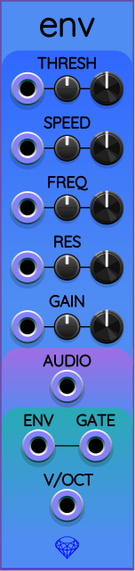
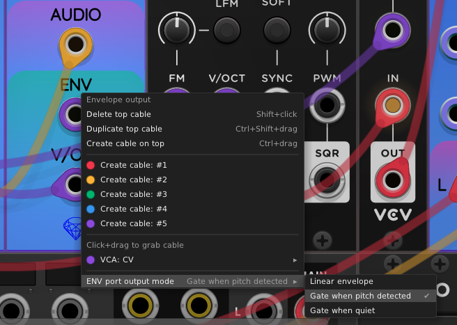

## Env

Env is a combination pitch detector and envelope follower. Given an input audio signal,
Env tries to detect the loudness and musical pitch of a single tone in it.

Env is mostly based on the pitch detector and envelope follower inside the Surge XT
[TreeMonster](https://library.vcvrack.com/SurgeXTRack/SurgeXTFXTreeMonster) module.
Both Env and TreeMonster "naively" measure pitch frequency based on time intervals
when the filtered waveform's voltage passes through zero.
In other words, both count samples between zero-crossings and smooth out the result over time to estimate pitch.
Env uses a different prefilter (based on [Sauce](Sauce.md) with FREQ and RES controls) than TreeMonster's LO CUT and HI CUT controls.
But the THRESH and SPEED controls are lifted directly from TreeMonster.

Thanks to [BaconPaul](https://github.com/baconpaul/) of Surge XT for the idea for, and support of, this project!

### Demo video

Here I create a drone with [Tube Unit](TubeUnit.md), then use Env to extract a pitch and envelope CV signal from both stereo audio channels. I reconstruct a sawtooth wave from that pitch and envelope. Mix it all together and add some reverb! (Note: this video was made before I added the GAIN control.)

### Controls

There are 5 controls for Env: THRESH, SPEED, FREQ, RES, and GAIN.
These controls assist making the pitch detector work better on a variety of possible inputs.
From left to right, each control consists of a CV input port,
a smaller attenuverter knob, and a larger control knob.

* **THRESH**: The amplitude threshold of the input signal needed to trigger pitch detection. The range is &minus;94&nbsp;dB to 0&nbsp;dB, with a default of &minus;24&nbsp;dB. Adjust as needed to report pitch for valid notes while rejecting any low-level noise while notes are not playing.
* **SPEED**: How quickly to slew reported output pitches. Lower values result in more stable note detection, but with a trombone-like glide through note changes. Faster values track changes in notes more quickly, but are more susceptible to unwanted variations of pitch (which can sound like birds twittering).
* **FREQ**: Adjusts the center frequency of a bandpass prefilter that helps narrow in on the intended pitch range of the notes being detected. This can help reject unwanted harmonics from the input audio.
* **RES**: Adjusts the resonance of the bandpass prefilter. Higher resonance can help squeeze the passband closer to the expected range of notes in the input audio. Too high a value can cause erroneous detection of notes at or near the center frequency.
* **GAIN**: When the ENV port is in linear output mode, the GAIN control multiplies the envelope voltage by an adjustable factor anywhere from 0 to 16. This knob displays this range in decibels as &minus;&infin;&nbsp;dB to +24&nbsp;dB. The default factor is 1, represented as 0&nbsp;dB on the knob.

### Polyphony

Env is fully polyphonic, meaning all 6 of its input ports (AUDIO and the 5 CV input ports) allow
independent control of up to 16 channels in the ENV and V/OCT output ports.
Each channel of output represents a completely independent combined pitch detector and envelope follower.

Whichever of the 6 input ports has the highest number of channels (1..16) determines the
number of channels in the two output ports ENV and V/OCT.
Any of the remaining 5 input ports having fewer channels will "clone" their final channel's
voltage across all the required output channels.

For example, if a cable connected to AUDIO has 2 channels (stereo),
and a cable connected to the FREQ CV input port has 1 channel,
and there are no other input cables,
then the outputs ENV and V/OCT will each have 2 channels.
Because in this example the FREQ CV signal has only 1 channel, that one channel
will be used to satisfy the second channel also.

If instead you used a 2-channel FREQ CV input cable, each of the two output channels
in the ENV and V/OCT ports would set their respective prefilters using the two CV voltages,
one for each channel in the output.

This system of polyphony treats all of the input ports equally, using the rules explained above.
As another example, you can put in 1-channel (mono) AUDIO
but perform up to 16 simultaneous pitch/env operations, all with different settings, so long as at least one of your CV input ports has a polyphonic cable attached to it.

### Audio Input

The AUDIO input port receives a cable with 1..16 channels of audio signal.

### Env Output

When you right-click on the ENV port, you will see the following context menu:

The option "ENV port output mode" provides the following 3 options:

* **Linear envelope**: This is the default mode. The ENV output port generates an amplitude signal that follows the overall amplitude of the input audio. The GAIN control adjusts the scale of the output voltage, as explained above. The envelope is not an audio-rate signal but a low-frequency CV signal that represents the volume of the input audio. Often envelope output will be used to drive a VCA that gates a voice, but other creative uses are possible.

* **Gate when pitch detected**: Send a high gate of +10&nbsp;V when a pitch is being detected. Otherwise it sends 0&nbsp;V. THRESH controls the minimum input audio level at which we send a high gate.

* **Gate when quiet**: Just like the previous option, only with the voltages reversed: sends 0&nbsp;V when a pitch is detected, otherwise +10&nbsp;V.

### V/OCT output

The V/OCT output reports the pitch of any detected signal. The zero volt level indicates
a C4 note (261.625&nbsp;Hz). Each unit volt indicates an octave away from C4. If no pitch can be detected,
this port may output &minus;10&nbsp;V as a placeholder.

### Attenuverters

Env supports [low-sensitivity mode](LowSensitivityAttenuverterKnobs.md) for all of its attenuverter knobs.
