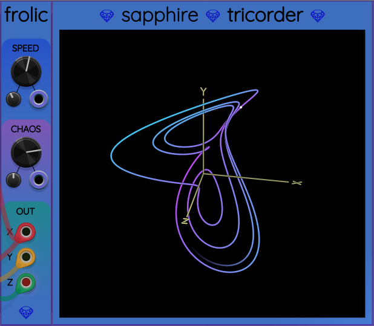

## Frolic

Frolic is a low frequency (and ultra-low frequency) chaotic oscillator.

### Mathematical basis

Frolic is based on the [Rucklidge Attractor](http://www.3d-meier.de/tut19/Seite17.html),
a system of three differential equations

$$
\frac{\mathrm{d}x}{\mathrm{d}t} = -2 x + a y - y z
$$

$$
\frac{\mathrm{d}y}{\mathrm{d}t} = x
$$

$$
\frac{\mathrm{d}z}{\mathrm{d}t} = -z + y^2
$$

The right sides of these equations are all linear functions
of $x$, $y$, and $z$. The left sides are all rates of change
of these variables with time.

The equations above convert the current location
of a particle into a velocity vector that points in the direction
the particle must move. No matter where the particle is, Frolic calculates
its velocity vector and uses it to update the particle's position vector.

### Knobs

**SPEED**: This knob allows varying how fast the simulation runs.
The default speed is 0, but speed may be set anywhere
from &minus;7 to +7. Each unit on this knob's scale represents a factor
of 2. That means when you change SPEED from 0 to +3, it will be $2^3=8$
times faster. Thus the speed can made $2^7=128$ times slower than the default
by turning the SPEED knob all the way to the left, or 128 times faster than
the default by turning it all the way to the right.

**CHAOS**: This knob controls the value of the $a$ parameter in the first equation.
The value of $a$ ranges from 3.8 to 6.7, which was experimentally determined
to give a wide range of orbital behavior: from highly ordered to highly chaotic.
In other words, when the CHOAS knob is set all the way down (&minus;1), the
value of $a$ is set to 3.8, resulting in a simple repeated loop.
If CHOAS is all the way right (+1), the value of $a$ is set to 6.7 and the
output of Frolic will be more chaotic.

### CV input
The SPEED and CHOAS knobs have associated attenuverters and CV input ports.
Both can be operated over the full knob range using a wide enough attenuverter setting.

### Graphing with Tricorder

[Tricorder](Tricorder.md) is a 3D oscilloscope designed for Frolic.
If you place a Frolic immediately to the left of a Tricorder, Frolic
will start to feed data into Tricorder, which will plot a 3D graph:

