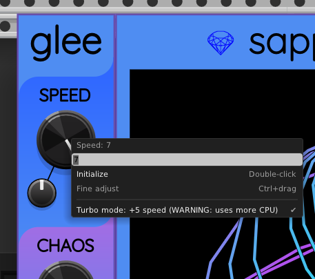
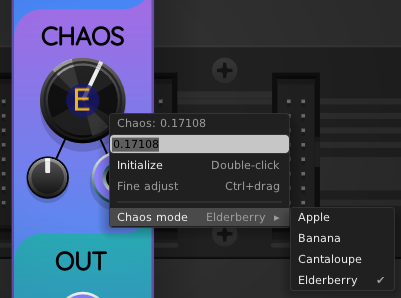
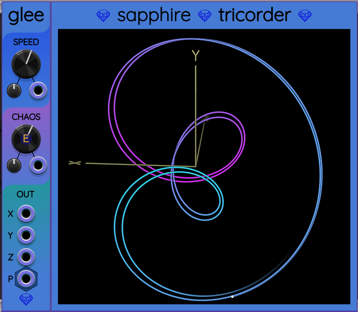

## Glee

Glee is a low frequency (and ultra-low frequency) chaotic oscillator.

### Demo video

[Omri Cohen](https://omricohen-music.com/) gives a tutorial of using Frolic and Glee to generate chaotic modulation:

### Mathematical basis

Glee is based on the [Aizawa Attractor](http://www.3d-meier.de/tut19/Seite3.html),
a system of three differential equations

$$
\frac{\mathrm{d}x}{\mathrm{d}t} = (z - B)x - D y
$$

$$
\frac{\mathrm{d}y}{\mathrm{d}t} = D x + (z - B)y
$$

$$
\frac{\mathrm{d}z}{\mathrm{d}t} = C + A z - \frac{z^3}{3} - (x^2+y^2)(1 + E z) + F z x^3
$$

The right sides of these equations are all linear functions
of $x$, $y$, and $z$. The left sides are all rates of change
of these variables with time.

The equations above convert the current location
of a particle into a velocity vector that points in the direction
the particle must move. No matter where the particle is, Glee calculates
its velocity vector and uses it to update the particle's position vector.

### Outputs

The outputs are available in two different forms, for convenience:

1. Three separate monophonic output ports for X, Y, and Z respectively.
2. A polyphonic port P that represents the vector (X, Y, Z) using 3 channels.

### Knobs

**SPEED**: This knob allows varying how fast the simulation runs.
The default speed is 0, but speed may be set anywhere
from &minus;7 to +7. Each unit on this knob's scale represents a factor
of 2. That means when you change SPEED from 0 to +3, it will be $2^3=8$
times faster. Thus the speed can made $2^7=128$ times slower than the default
by turning the SPEED knob all the way to the left, or 128 times faster than
the default by turning it all the way to the right.

However, at the risk of using a **LOT** more CPU time, you can right-click
on the SPEED knob and toggle "Turbo Mode", which adds a +5 bonus to the SPEED value.
This is the same as multiplying the effective speed by 32.

**CHAOS**: This knob controls the value of a constant in the Aizawa attractor in a way that varies the nature of its chaotic orbit.

Glee supports 4 distinct *chaos modes* that are named after kinds of fruit.
Each fruit name starts with the same letter as the Aizawa parameter being controlled:

* Apple for $A$.
* Banana for $B$.
* Cantaloupe for $C$. (This mode is boring, but kept for backward compatibility.)
* Elderberry for $E$.

When loading patches that were made before Glee supported chaos modes,
Glee preserves backward compatibility by using Cantalope mode.

However, because any of the other three modes is far more interesting than
Cantaloupe, the default for newly created instances of Glee is Apple.

You can change the chaos mode by right-clicking on the CHAOS knob and selecting one of the chaos mode options:

Both Turbo Mode and Chaos Mode are also available in the right-click menu of the Glee panel.

### CV input
The SPEED and CHOAS knobs have associated attenuverters and CV input ports.
Both can be operated over the full knob range using a wide enough attenuverter setting.

### Graphing with Tricorder

[Tricorder](Tricorder.md) is a 3D oscilloscope designed for compatibility with Glee.
If you place a Glee immediately to the left of a Tricorder, Glee
will start to feed data into Tricorder, which will plot a 3D graph:

