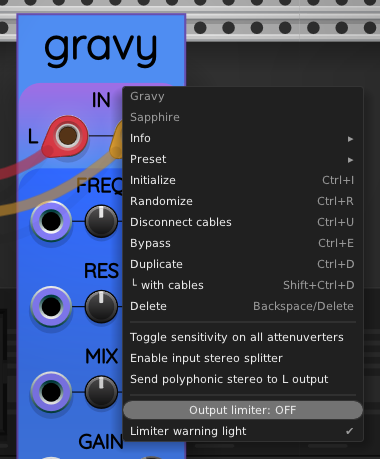

## Gravy

Gravy is a stereophonic state-variable filter as described in the following paper by Andrew Simper (Cytomic). See page 6 of that paper for the equations used in Gravy.

> https://cytomic.com/files/dsp/SvfLinearTrapOptimised2.pdf

For a more general polyphonic module based on the same state variable filter algorithm,
see [Sauce](Sauce.md).

### Controls

Gravy provides control over the following parameters:

* **FREQ**: the filter's corner frequency. The default setting is 0, which corresponds to the note C5 = 523.251&nbsp;Hz. Each unit on the FREQ dial represents an octave. The dial spans &pm;5 octaves around the note C5.
* **RES**: the filter's resonance, on a scale from 0 (the default) to 1. Higher resonance causes the filter to concentrate the passband closer in to the corner frequency. Toward the upper end of the resonance scale, you can even get sustained oscillations, also known as "ringing".
* **MIX**: A value from 0 to 1 that controls how much of the original, unfiltered stereo signal is included in the output. The default MIX value is 1, which means that the output represents 100% filtered audio. As the value is decreased toward 0, more of the original audio is included in the output. At zero, the output is identical to the input (except for a one-sample delay inherent to all VCV Rack modules).
* **GAIN**: Allows you to make the output louder or quieter, as a convenience. Consider it a built-in VCA.
* **MODE**: Gravy can operate in three modes, selected by clicking the MODE switch:
    * Lowpass: left switch position. Lower frequencies pass through the filter but higher frequencies are suppressed.
    * Bandpass: middle switch position. Frequencies near the corner frequency are passed, but higher and lower frequencies are suppressed.
    * Highpass: right switch position. Frequencies above the corner frequency are passed, but lower frequencies are suppressed.

Each of the controls except for MODE include a CV input port, a smaller attenuverter knob, and a larger manual control knob.

### Context menu

When you right-click on the Gravy panel, you will see the following context menu:

### Toggle sensitivity on all attenuverters

Gravy supports [low-sensitivity attenuverters](LowSensitivityAttenuverterKnobs.md).
This option toggles the sensitivity mode on all the attenuverter knobs.

### Inputs and outputs

Gravy has two audio input ports at the top of the panel, L and R.

Likewise, there are two audio output ports at the bottom also labeled L and R.

You can provide mono (1 mono cable), stereo (2 mono cables),
or 1 polyphonic [stereo splitter cable](#stereo-splitter-option) as input.

To provide mono input, connect your audio cable to the left input L **or** the right input R.
When only one of the inputs is connected to a cable, Gravy will send half the voltage
on that cable to both the left and right reverb inputs. The voltage is divided by 2
to preserve the same general volume level as mono input would if fed to a single channel.

To provide stereo input, connect one cable to L and one cable to R.

Polyphonic input cables are summed across channels to provide
a monophonic input signal for the port they are plugged into.
This is true for the two audio input ports and all 5 CV input ports.

Gravy's left and right audio output ports are each monophonic.

### Stereo splitter option

The context menu option [Enable input stereo splitter](#context-menu) overrides the audio input behavior
described above, but only when a polyphonic cable is connected to either
L or R. For the stereo splitter to work, the opposite port must remain unconnected.

If the single audio input cable has 2 or more channels, and the stereo splitter
option is enabled, the cable's first channel is sent to the left input and its second
channel is sent to the right input. Any remaining channels are ignored.

To confirm that the stereo splitter is actually operational, the "L" and "R"
input port labels are replaced by a single "2" label on whichever input
port is connected to the polyphonic input cable.

The purpose of this option is to support a stereo input provided by a single
cable, which can eliminate the need for a dedicated splitter module between
the signal and Gravy.

### Send polyphonic stereo to L output

When checked, this option causes stereo output to go to the L output only.
The output is polyphonic with 2 channels, with channel 0 as the left
output and channel 1 as the right output.

Enabling polyphonic stereo output causes the output port labels to change from "L" and "R"
to a "2" displayed on the left output port only.

### Output limiter

Sometimes the output voltage from Gravy can be excessively large, especially
if you use high resonance settings. It can be helpful to keep the output under
control. To meet this need, Gravy includes a built-in output limiter option.

In the context menu, the output limiter appears as a horizontal slider.
By default, the limiter is turned OFF. If you start to pull this horizontal
slider to the left using your mouse, the limiter turns on. You can adjust the
output limiter to any value from 5&nbsp;V to 50&nbsp;V. You can turn the limiter
back off by sliding the level all the way to the right.

When the output limiter is enabled, and the output goes beyond the limit,
the limiter causes the GAIN knob to glow red as an indicator that the output
level is being attenuated.

Also in the context menu is the toggle option "Limiter warning light".
By default, the warning light is enabled, causing the GAIN knob to glow red
when the limiter is actively reducing the output level. You can uncheck this
option to turn the red glow off.
