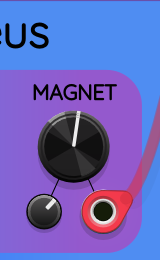
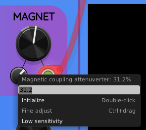

## Low sensitivity attenuverter knobs

Many Sapphire modules include combinations of a large
control knob, a small attenuverter knob, and a CV input.
These are called *control groups*.
For example, in Sapphire Nucleus, there are 5 control groups
labeled SPEED, DECAY, MAGNET, IN, and OUT:

Many times I have found cases where a very small attenuverter
knob tweak causes a massive change in the nature of the generated sound.
I found it difficult to adjust the attenuverter knobs by a small enough amount.
Therefore, I added the ability to right-click on any attenuverter knob
and select an option called *low sensitivity mode*.

In low sensitivity mode, the attenuverter's effect is diminished by
a factor of 10. In other words, if you set the attenuverter knob to
10%, but enable low sensitivity, it acts as though you have set it to 1%.

Let's use the MAGNET attenuverter in Sapphire Nucleus as an example

To toggle low sensitivity mode, right-click on the attenuverter knob.
A menu will appear like this:

Click on the option "Low sensitivity" to enable it.
Now the MAGNET attenuverter knob includes an orange dot
to indicate that low sensitivity mode is active.

Now the knob setting will operate at 1/10 of its usual sensitivity.
You can turn low-sensitivity back off by repeating the procedure
with the context menu.

## Toggle all knobs

In Elastika, Nucleus, and Polynucleus, in addition to toggling the
attenuverter knobs one at a time, you can right-click on the module
itself to find an option titled "Toggle sensitivity on all attenuverters".

For example, you can see it in the context menu for Elastika:

Every time you click on this menu item, it will either turn all
the attenuverters to low-sensitivity mode, or all to normal mode.
It decides by letting the existing attenuverters "vote" for their
collective opposite: if more than half of the attenuverters are enabled,
the menu item will disable them all. Otherwise, all will be enabled.
