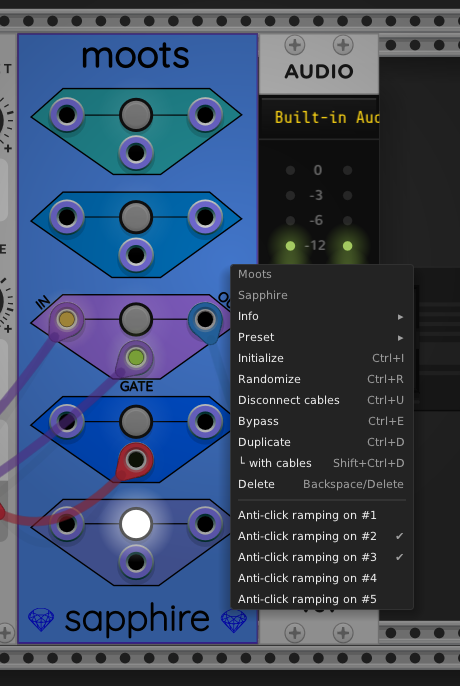

## Moots

The Sapphire Moots module is similar to the
[VCV Mutes](https://library.vcvrack.com/Fundamental/Mutes) module,
but differs in the following ways:

* Instead of toggling between the input signal or a zero volt
  signal like VCV Mutes does, Sapphire Moots toggles between
  the input signal and an unplugged cable.
  Sometimes the result is completely different, as explained
  in more detail below.

* Each instance of the Sapphire Moots module contains 5 independent
  controls instead of the 10 that VCV Mutes has.

* Each Moots control has a push-button like VCV Mutes does,
  but it also has a gate input that allows replacing the button with
  a control voltage.

When there is no cable connected to a gate input,
the manual push-button takes control.
But when there is a cable connected to a control's gate,
the control connects the input to the output when the
gate voltage is +1.0 volts or higher. When the gate voltage
drops below +0.1 volts, the output cable acts like it is
unplugged.

To help filter signal jitter, the state stays the same
when the gate voltage is between +0.1V and +1.0V.
In other words, Schmitt trigger logic is applied.

A polyphonic cable connected to a gate has all
of its channel voltages added together, and the +0.1V/+1.0V rules
above are applied to that sum.

I created this module after I discovered one day that the
[Audible Instruments Resonator](https://library.vcvrack.com/AudibleInstruments/Rings)
module didn't behave the way I expected when I placed a VCV Mutes
control in series with the Resonator's `IN` jack. When I muted
the input, I expected the Resonator to act as if the input were
unplugged. Instead, the sound faded to silence and stayed there.

I realized that a 0V signal is not the same thing as an unplugged cable.
I searched for a module that would simulate plugging and unplugging a
cable from a target jack, but could not find one. So I decided to create
one myself. Moots is the result.

The following video demonstrates how Sapphire Moots works,
and how its effects are different in some cases from VCV Mutes:

Technical note: Moots simulates unplugging all cables connected
to its output jack by setting the output jack to have zero channels.
To simulate enabled (plugged-in) cables, the jack is set to the
same number of polyphonic channels as the input signal, and the
input signal is copied verbatim to the output jack.
Moots supports the full range of polyphonic channels allowed
by VCV Rack, namely 1 to 16.

When in the quasi-unplugged state, all cables coming out of the
output jack will appear more transparent than a normal cable.
When in the enabled state, all such cables will appear
with normal opacity and the correct thickness for their polyphony.

Any other module's input jack that receives one of these faint-looking
"unplugged" cables will act as if it is not connected to anything,
because VCV Rack does not distinguish between an unplugged jack
and a jack connected to a zero-channel cable.

### Moots Configuration

The right-click context menu for Moots looks like this:

The menu contains "Anti-click ramping" options for all five controls.
Anti-click ramping, when enabled, causes the corresponding control to
fade the polyphonic voltages down to zero before disconnecting a cable,
and to fade the voltages up from zero after reconnecting a cable.
The fading is a linear ramp that lasts for 1/400 of a second (2.5 ms).
When a Moots control is used to plug/unplug an audio signal, enabling
anti-click ramping can be useful to prevent clicking or popping sounds.

By default, anti-click is disabled, which is usually a better choice
when using a Moots control for plugging/unplugging control voltage (CV)
signals. When anti-click is disabled, the cable is connected or
disconnected instantly without any fading.

---

[Sapphire module list](README.md)
