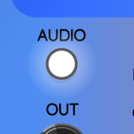
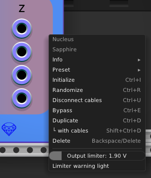
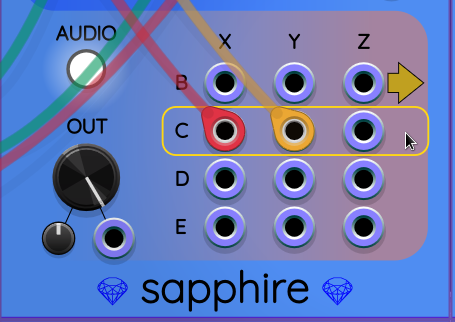

## Nucleus

Nucleus is a 3D vector synthesizer that can be used
for generating complex control voltages or audio signals.
It is based on a simulation using a few imaginary physical laws.
In the simulation, there are five particles moving in 3D space.
The particles are labeled A, B, C, D, E.
The particles interact with each other via forces, as discussed below.

The input to Nucleus is the 3D position of particle A expressed as
three voltages AX, AY, AZ.

The output of Nucleus is the 3D position of all the other particles B, C, D, E.

See also: [Polynucleus](Polynucleus.md), a version of Nucleus more tailored
for vector-oriented workflows.

### Demo videos

Here is a video to help get started with Sapphire Nucleus. It shows a basic
audio setup, how to connect the cables, and how to set the controls on Nucleus.

Sapphire Nucleus can be used with feedback to create chaotic/glitchy sounds:

The next example is a haunted house soundtrack generator. This time I used two Nuclei, one as a low frequency CV generator, the other as an instrument voice in duet with [Bogaudio FM-OP](https://library.vcvrack.com/Bogaudio/Bogaudio-FMOp). The original idea for Nucleus was as a low frequency CV generator with lots of outputs that are frequency-compatible but different from each other, and all potentially chaotic.

In the following video, [Alphagem-O](https://community.vcvrack.com/u/alphagem-o/summary) demos making seven different sound effects using Nucleus:

### Control groups

Let us call the combination of a large parameter knob, a small attenuverter knob,
and a CV input port a *control group*. Nucleus includes the following control groups:

* **SPEED**: Adjusts the rate at which time flows in the simulation. The knob range is &minus;6&nbsp;...&nbsp;+6. Each unit on this scale represents a factor of two. For example, adjusting SPEED from +3 to +4 makes the simulation run twice as fast. Lower values of SPEED produce very low frequency output that can be used for control voltages. Higher values can produce audible frequencies.
* **DECAY**: Adjusts friction in the system that causes vibrations to die out. Higher values of DECAY cause more reverberant sounds, which can sometimes lead to unwanted strong oscillations. Lower values cause energy to die out quickly, resulting in more percussive sounds or less reverberant filtering of the input.
* **MAGNET**: Adjusts the relative strength of the magnetic force with respect to the attractive and repulsive forces. The range of values is &minus;1&nbsp;...&nbsp;+1. The default value is 0, which means there is no magnetic force at all. Positive and negative values have similar effects, but in opposite directions of space.
* **IN**: Adjusts the strength of the vector input A. This is a drive setting. If the IN knob is turned all the way down, the input has no effect.
* **OUT**: Adjusts the level of the output vectors B, C, D, E. This control works in cooperation with the [output limiter](#output-limiter).

All attenuverter knobs in Nucleus support a [low sensitivity option](LowSensitivityAttenuverterKnobs.md),
which is often helpful for making CV control easier to adjust.

### Mode button (AUDIO/CONTROL)
This button toggles between AUDIO mode and CONTROL mode. In AUDIO mode, the output vectors are filtered with a DC-reject highpass filter. This filter has a corner frequency of 30&nbsp;Hz. In CONTROL mode, the output vectors directly represent the raw position vectors in space, without any DC rejection applied.

In AUDIO mode, the word "AUDIO" appears above the button, and the button lights up:

In CONTROL mode, the word "CONTROL" appears above the button, and the button stays dark:

Changing between AUDIO and CONTROL mode does nothing to the SPEED setting; you will often need to adjust SPEED to a lower value for control outputs, or a higher setting for audio outputs, as a separate step.

### Physics model

In Nucleus, there are five simulated particles that interact with
each other via a combination of forces that loosely mimic the
forces acting inside an atomic nucleus. Just like real protons,
the particles in Nucleus experience

* a mutually repulsive electrical force
* a mutually attractive strong nuclear force
* a magnetic force that operates at right angles to both particles' velocity vectors

(There is no attempt to include the weak nuclear force in this simulation.)

The particles are labeled A, B, C, D, and E. Particle A is the input particle.
Nucleus feeds three inputs labeled AX, AY, and AX. These three voltages specify
the position of Particle A at each moment in time.

By controlling Particle A's position, the other particles experience varying forces
that cause them to move and interact with each other. The output positions of
the particles B, C, D, E yield four vectors that have three dimensions each,
for a total of 12 output voltages.

The equation for the force vector between a pair of particles $i$ and $j$ is

$$
\overrightarrow F_{ij} = \left( R - \frac{1}{R^3} \right) \overrightarrow R + \frac{\mu}{R^3} \left( \overrightarrow V \times \overrightarrow R \right)
$$

where

* $\overrightarrow F_{ij}$ is the force of particle $j \in \lbrace \mathrm A, \mathrm B, \mathrm C, \mathrm D, \mathrm E \rbrace$ acting on particle $i \in \lbrace \mathrm A, \mathrm B, \mathrm C, \mathrm D, \mathrm E \rbrace$ where $i \ne j$. By Newton's laws, this force is equally strong but opposite in direction to the force of particle $i$ acting on particle $j$. That is, $\overrightarrow F_{ij} = -\overrightarrow F_{ji}$ for all pairs of distinct particles. This force symmetry is required for a realistic and stable simulation; otherwise, it is possible for the particles to explode in all directions!
* $\overrightarrow R$ is the relative difference in position between the two particles: $\overrightarrow R = \overrightarrow r_j - \overrightarrow r_i$.
* $R = | \overrightarrow R |$ is the scalar distance between particles $i$ and $j$.
* $\mu$ is the *magnetic coupling coefficient* that expresses how strong the magnetic force is relative to the repulsive and attractive forces. The value of $\mu$ is controlled by the MAGNET knob. The allowed range is $-1 \le \mu \le +1$. Negative values reverse the direction of the magnetic field compared to positive values.
* $\overrightarrow V$ is the *effective velocity* difference between the two particles. The direction of the velocity vector is left as-is, but its magnitude is conditioned using a bicubic limiter to improve stability of the simulation. The bicubic formula used by Nucleus is:

$$
y = \frac {4 x^3} {27 L^2}
$$

where $y$ is the effective speed, $x$ is the raw speed, and $L$ is the maximum allowed value
of the effective speed. When $|x| \gt \frac{3}{2} L$, the value of $y$ is clamped to $\pm L$.

The three inputs for Particle A's position vector are amplitude-controled by the IN level control group.

The outputs are amplitude-controled by the OUT level control group.
They are also optionally fed through a DC-reject filter when <a href="#mode-button-audiocontrol">AUDIO mode</a> is enabled.

For developers interested in more details, the
[C++ class `NucleusEngine`](https://github.com/cosinekitty/sapphire/blob/main/src/nucleus_engine.hpp)
shows exactly how the Nucleus DSP engine works.
Incidentally, it is possible to use the Nucleus engine in your own projects outside of VCV Rack.
The engine class is designed to not have any dependencies on VCV Rack.

### Context menu

Nucleus's context menu looks like this:

It includes a couple of options for an output limiter, as described below.

### Output limiter

Nucleus's physical model can produce a surprisingly wide range
of output voltage levels. The amplitude can be hard to predict, so as a safeguard,
Nucleus includes an output limiter that uses automatic gain control
to keep the output voltages within a reasonable range.

The limiter can be enabled or disabled. When enabled,
it can be set to any threshold level between 1V and 10V.
When the limiter is enabled, it will adapt automatically
to output voltages higher than its threshold by quickly
reducing output gain. If the volume gets quieter than
the level setting, the limiter allows the gain to settle
back to a maximum of unity gain (0 dB).
This means the limiter never makes the output louder
than it would be if the limiter were disabled.

By default, the limiter is enabled and is configured for a 4V threshold.
Using Nucleus's right-click context menu, you can slide
the limiter threshold left or right anywhere from 1V to 10V.

If you move the slider all the way to the right, it will
turn the limiter OFF.
Disabling the limiter like this can result in extreme output voltages in
some cases, but it could make sense for patches where Nucleus's output
is controlled by some external module, such as a mixer with a very low setting.
Most of the time, it's a good idea to leave the limiter enabled,
to avoid extremely loud sounds and clipping distortion.

### Limiter distortion warning light

When Nucleus's limiter is enabled, and the output
level is so high that the limiter is actively working
to keep it under control, the sound quality will not
be ideal. Therefore, Nucleus signals a warning by
making the output level knob glow red, like this:

This is a hint that you might want to turn down the
output knob a little bit, or do something else to
make Nucleus quieter, in order to eliminate any
distortion introduced by the limiter.
Of course, you are the judge of sound quality, and you
may decide to ignore the limiter warning if you are
getting good results in your patch.

If you disable the limiter, this is interpreted as a
manual override, and the warning light will not turn on.

If you don't want the warning light to come on, but you
want to keep the limiter enabled, there is an option
for this in the right-click context menu labeled
*Limiter warning light*. Clicking on this option
will toggle whether the warning light turns on
when the limiter is active. The warning light option
defaults to being enabled.

### Graphing output using Tricorder
If you place a [Tricorder](Tricorder.md) module immediately to the right of a Nucleus module,
Tricorder will start graphing one of the output vectors B, C, D, or E.
By default, Tricorder graphs output B:

You can change which particle's position vector is graphed by hovering the mouse over
the area to the right of the Z output port for the desired row:

When you see the yellow box surround your desired output row, click there.
Nucleus will change which output it sends to Tricorder, as reflected by moving the yellow arrow there:

### Treatment of polyphonic inputs

All 12 output ports from Nucleus are monophonic voltages.

All input ports, including the CV inputs and the three vector inputs, allow polyphonic inputs, but the voltages are added together to produce a single input sum. Thus each input port acts as a unity gain mixer that feeds a single voltage value into Nucleus.

---

[Sapphire module list](README.md)
