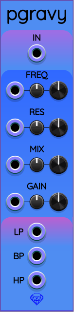
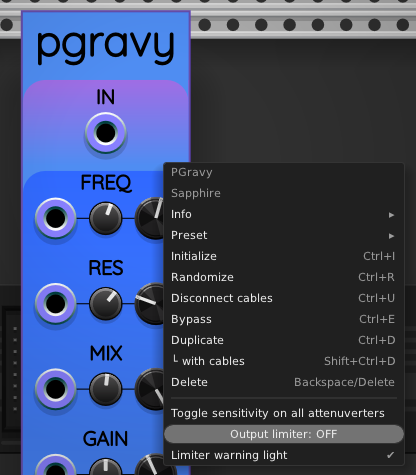

## PGravy

PGravy is a polyphonic state-variable filter as described in the following paper by Andrew Simper (Cytomic). See page 6 of that paper for the equations used in PGravy.

> https://cytomic.com/files/dsp/SvfLinearTrapOptimised2.pdf

PGravy is very similar to the stereo filter [Gravy](Gravy.md), but is optimized for general polyphonic use.

### Controls

PGravy provides control over the following parameters:

* **FREQ**: the filter's corner frequency. The default setting is 0, which corresponds to the note C5 = 523.251&nbsp;Hz. Each unit on the FREQ dial represents an octave. The dial spans &pm;5 octaves around the note C5.
* **RES**: the filter's resonance, on a scale from 0 (the default) to 1. Higher resonance causes the filter to concentrate the passband closer in to the corner frequency. Toward the upper end of the resonance scale, you can even get sustained oscillations, also known as "ringing".
* **MIX**: A value from 0 to 1 that controls how much of the original, unfiltered stereo signal is included in the output. The default MIX value is 1, which means that the output represents 100% filtered audio. As the value is decreased toward 0, more of the original audio is included in the output. At zero, the output is identical to the input (except for a one-sample delay inherent to all VCV Rack modules).
* **GAIN**: Allows you to make the output louder or quieter, as a convenience. Consider it a built-in VCA.

Each of the controls include a CV input port, a smaller attenuverter knob, and a larger manual control knob. The CV input ports all support full polyphony. Missing channels are normalled forward. For example, this means you can use a 1-channel cable connected to the FREQ CV input to control all 3 signals in a 3-channel audio input. Or you could use 3-channel CV input to control the frequencies independently.

### Context menu

When you right-click on the PGravy panel, you will see the following context menu:

### Toggle sensitivity on all attenuverters

PGravy supports [low-sensitivity attenuverters](LowSensitivityAttenuverterKnobs.md).
This option toggles the sensitivity mode on all the attenuverter knobs.

### Output limiter

Sometimes an output voltage from PGravy can be excessively large, especially
if you use high resonance settings. It can be helpful to keep the output under
control. To meet this need, PGravy includes a built-in output limiter option.

In the context menu, the output limiter appears as a horizontal slider.
By default, the limiter is turned OFF. If you start to pull this horizontal
slider to the left using your mouse, the limiter turns on. You can adjust the
output limiter to any value from 5&nbsp;V to 50&nbsp;V. You can turn the limiter
back off by sliding the level all the way to the right.

When the output limiter is enabled, and the output goes beyond the limit,
the limiter causes the GAIN knob to glow red as an indicator that the output
level is being attenuated.

Also in the context menu is the toggle option "Limiter warning light".
By default, the warning light is enabled, causing the GAIN knob to glow red
when the limiter is actively reducing the output level. You can uncheck this
option to turn the red glow off.
