# Sapphire modules for VCV Rack 2

## Installation
The latest release of the Sapphire plugin is available in the
[VCV Rack Library](https://library.vcvrack.com/CosineKitty-Sapphire).

## Video gallery
Videos of [VCV Rack patches using Sapphire modules](VideoGallery.md) by myself and others.
No talking, just patching and listening.

---

## Elastika

A complex sound generator that simulates the physics of a
hexagonal mesh of balls and springs.

<a href="Elastika.md">Sapphire Elastika documentation</a>

---

## Frolic

A low-frequency and ultra-low-frequency chaotic oscillator
for generating 3 simultaneous smooth but unpredictable voltages.

<a href="Frolic.md">Sapphire Frolic documentation</a>

<a href="Frolic.md">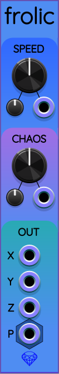</a>

---

## Galaxy

Galaxy is a stereo reverb filter, and is a clone of the
[Airwindows](https://library.vcvrack.com/Airwin2Rack/Airwin2Rack) Galactic algorithm
by [Chris Johnson](https://github.com/airwindows/airwindows).

<a href="Galaxy.md">Sapphire Galaxy documentation</a>

<a href="Galaxy.md">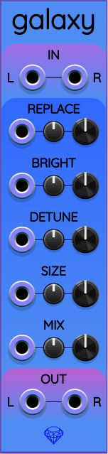</a>

---

## Glee

Another low-frequency and ultra-low-frequency chaotic oscillator
for generating 3 simultaneous smooth but unpredictable voltages.

<a href="Glee.md">Sapphire Glee documentation</a>

<a href="Glee.md">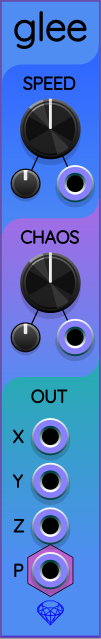</a>

---

## Gravy

A stereo filter with CV-controllable frequency, resonance, mix, and gain.
Operates in lowpass, bandpass, or highpass mode.

<a href="Gravy.md">Sapphire Gravy documentation</a>

<a href="Gravy.md">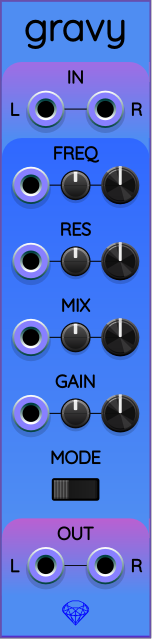</a>

---

## Hiss

A random vector generator whose outputs point in all directions of an N-dimensional space with equal probability. Useful for generating vector noise input to physics simulations like Nucleus.

<a href="Hiss.md">Sapphire Hiss documentation</a>

---

## Moots

Simulates plugging/unplugging cables,
which is sometimes different from setting their voltages to 0.

<a href="Moots.md">Sapphire Moots documentation</a>

<a href="Moots.md">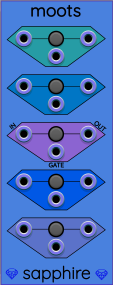</a>

---

## Nucleus

A simulation of five particles obeying alternative laws of physics.
The output can be used for control voltages or audio signals.

<a href="Nucleus.md">Sapphire Nucleus documentation</a>

<a href="Nucleus.md">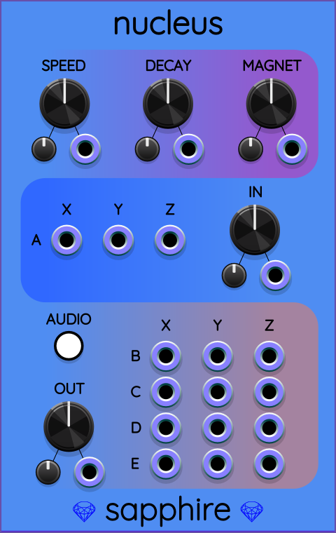</a>

---

## Pivot

Twists an input 3D vector by a CV-adjustable angle.
Pivot is useful in combination with [Frolic](Frolic.md), [Glee](Glee.md), and [Rotini](Rotini.md)
to create novel chaotic control signals for modulating generative movement in your patches.

<a href="Pivot.md">Sapphire Pivot documentation</a>

<a href="Pivot.md">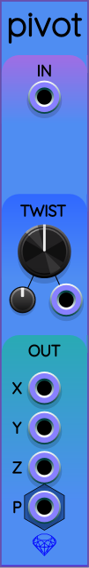</a>

---

## Polynucleus

Just like Nucleus, only with a single polyphonic port
for each particle instead of 3 monophonic ports.

<a href="Polynucleus.md">Sapphire Polynucleus documentation</a>

<a href="Polynucleus.md">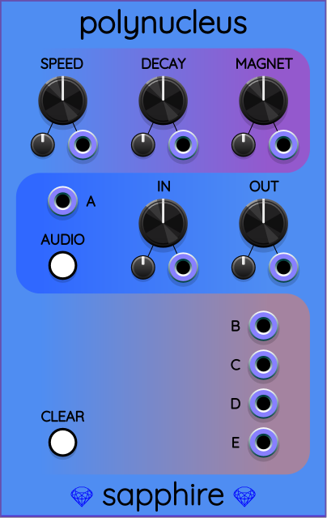</a>

---

## Pop

A polyphonic trigger generator that can simulate the statistical
behavior of radioactive decay, generate completely regular pulses,
or anywhere in between.

<a href="Pop.md">Sapphire Pop documentation</a>

---

## Rotini

A utility module for combining Frolic/Glee into more complex chaotic 3D vector signals.
Calculates the cross product of two input vectors.

<a href="Rotini.md">Sapphire Rotini documentation</a>

<a href="Rotini.md">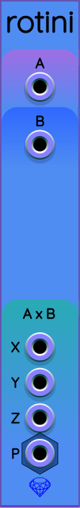</a>

---

## Split/Add/Merge (SAM)

Splits, adds, and/or merges a stereo or 3D polyphonic signal with 2 or 3 monophonic signals.
This is like VCV Merge and VCV Split combined, but only for a maximum of 3 channels.
SplitAddMerge saves patch screen space because it is only 2 HP wide.

<a href="SplitAddMerge.md">Split/Add/Merge documentation</a>

---

## Tin

An alterative input module for feeding data into Tricorder.

<a href="Tin.md">Sapphire Tin documentation</a>

<a href="Tin.md">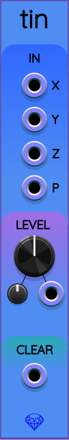</a>

---

## Tout

A utility for extracting vector data from Tricorder as output ports.

<a href="Tout.md">Sapphire Tout documentation</a>

<a href="Tout.md">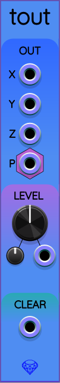</a>

---

## Tricorder

A 3D oscilloscope designed for Frolic, Glee, and other 3D signals.

<a href="Tricorder.md">Sapphire Tricorder documentation</a>

<a href="Tricorder.md">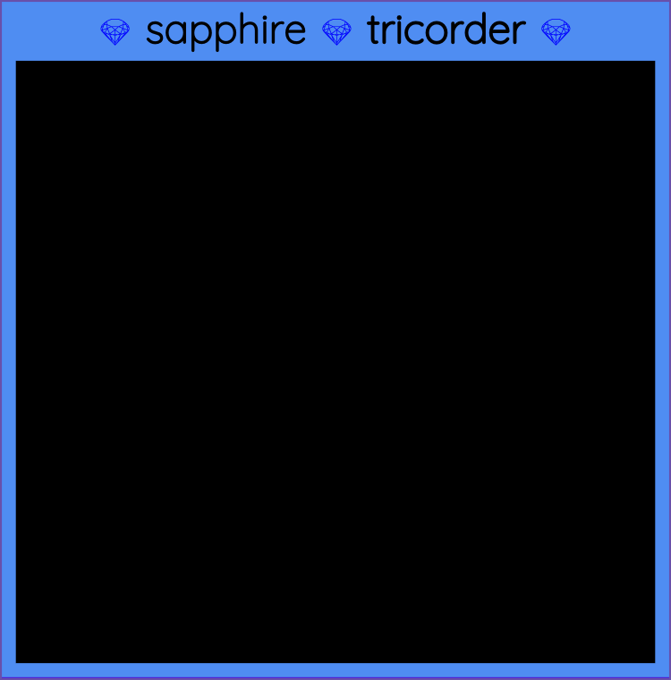</a>

---

## Tube Unit

A complex tubular waveguide synthesizer.

<a href="TubeUnit.md">Sapphire Tube Unit documentation</a>

<a href="TubeUnit.md">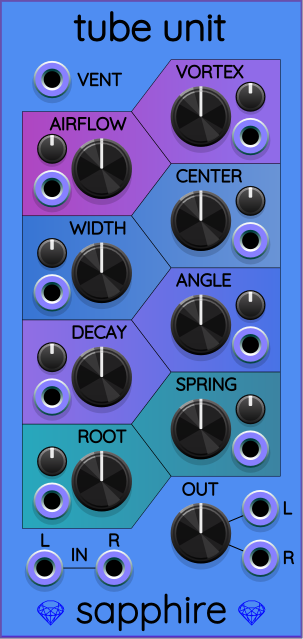</a>

