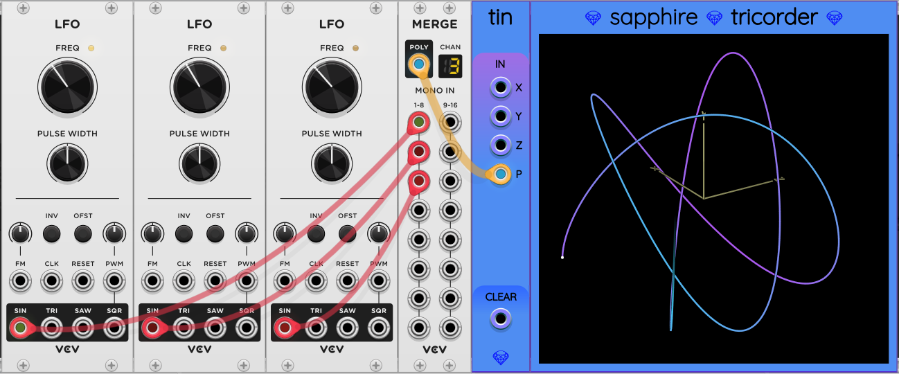

## Tin


The name Tin stands for "Tricorder INput". Tin is an auxiliary input module for [Tricorder](Tricorder.md).
It allows you to feed any 3 voltages you want to be graphed in 3D space by Tricorder.

All you have to do is place Tin to the immediate left of Tricorder and it they will connect
the signal path for you:


The X, Y, and Z ports convert sum signals on any polyphonic cables into a single voltage.

You can also provide a polyphonic input to the P port. Ideally, the input cable will have 3 channels for X, Y, and Z:



If both monophonic and polyphonic inputs are provided, the respective values are added together to get effective X, Y, and Z inputs:

```
x = (sum(X) + P[0]) * level
y = (sum(Y) + P[1]) * level
z = (sum(Z) + P[2]) * level
```

where `sum(X)` represents the sum of all the channel voltages of the cable connected to the X port, `P[0]` represents the voltage of channel 0 on the P port, if it exists, and `level` is the effective dB gain of the LEVEL knob, attenuverter, and CV input.

The CLEAR input is a trigger that tells any connected Tricorder to clear the screen. After clearing the screen Tricorder starts accumulating and graphing data again as soon as it's available.
