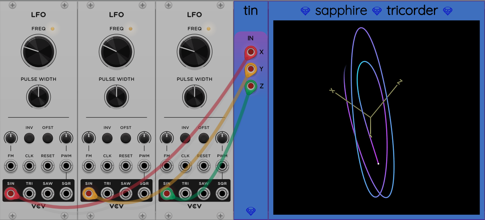

## Tin

The name Tin stands for "Tricorder INput". Tin is an auxiliary input module for [Tricorder](Tricorder.md).
It allows you to feed any 3 voltages you want to be graphed in 3D space by Tricorder.

All you have to do is place Tin to the immediate left of Tricorder and it they will connect
the signal path for you:

