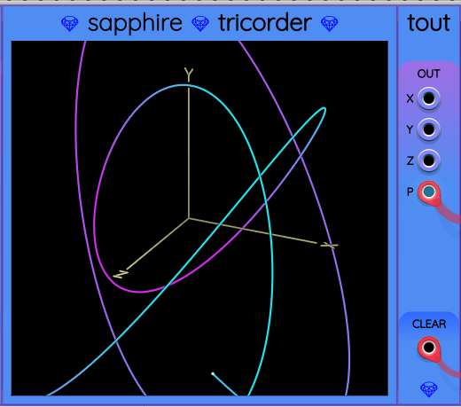

## Tout

The name Tout stands for "Tricorder OUTput". Tout is an auxiliary output module for [Tricorder](Tricorder.md).
You can place Tout immediately to the right of a Tricorder to receive a copy of the vector it is graphing, along with a copy of the CLEAR trigger that was sent to ask Tricorder to clear its display.

Outputs are provided individually as monophonic X, Y, and Z ports.

They are also available together as a single 3-channel polyphonic (X, Y, Z) signal on the P port.
