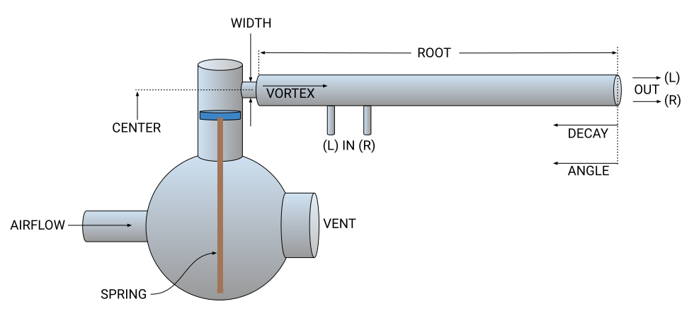
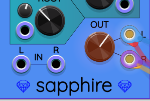
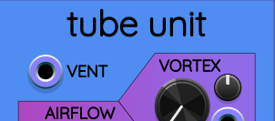

## Tube Unit

Tube Unit is a stereo effect synthesizer based on waveguide resonance.
It can generate sounds on its own or act as a filter to process input audio.
It creates a wide variety of sounds with complex textures and frequency components,
along with a versatile stereo field.

### Demo videos

Here are some videos demonstrating Tube Unit in action.
Headphones are recommended to best experience the stereo field.

Simple demo of Tube Unit operation:

Example of polyphonic capabilities:

### Physics model

Tube Unit is loosely based on a physical acoustics model of a resonant tube,
but with some fanciful departures from real-world physics to make it more fun.

Air flows into a sealed spheroid chamber as indicated by AIRFLOW in the diagram above.
As pressure builds up in the chamber, it causes increasing force on a spring/piston assembly.
The force causes the spring to stretch, lifting the piston higher.

As the piston reaches the CENTER line, it allows air to escape into the ROOT tube.
As air escapes, pressure in the chamber starts to decrease, allowing the spring to
pull the piston back down. This sets up a vibrating movement similar to a reed
in a woodwind instrument or a trumpet player's lips.

As air enters the ROOT tube, its pressure is modified by a VORTEX parameter (described below),
causing a pressure wave to travel down the length of the tube at the speed of sound.
Air has mass, and therefore carries momentum. The momentum of air leaving the tube
causes a little excess pressure to be pulled out of the end of the tube,
causing a negative pressure to build up there.

Extra control parameters DECAY and ANGLE are involved in reflections of negative
pressure from the far end of the tube. DECAY causes loss of energy in the reflection,
thus allowing the energy to die down. ANGLE adds a rotation in circular polarization
of the pressure wave.

This polariazation idea is where we depart from traditional physics.
Instead of the air pressure in the system being a real number, Tube Unit
models air pressure as a complex number. The complex value of the pressure
leaving the tube becomes a stereo output signal. The pressure's real value
is used for the left channel, and the imaginary value is used for the right channel.

More precisely, DECAY is a real factor $0 \le \rho \lt 1$ that attenuates the reflected
pressure, and ANGLE is a complex factor $e ^ {i \theta}$ that rotates its stereo orientation.

Complex-valued pressure waves keep bouncing back and forth in the tube, interacting
with the piston and affecting the chamber pressure whenever the piston seal is open.

The next section describes Tube Unit's controls in more detail.

### Control groups

Tube Unit's panel includes 8 *control groups*, each consisting of a large manual
control knob, a small attenuverter knob, and a control voltage (CV) port. A pentagon
with a colored background delimits each control group.

All attenuverter knobs in Tube Unit support a [low sensitivity option](LowSensitivityAttenuverterKnobs.md),
which is often helpful for making CV control easier to adjust.

* **AIRFLOW**: Controls the rate at which air is forced into the spheroid chamber.
It is analogous to how hard a trumpet player blows into a trumpet.
* **VORTEX**: Introduces an angular rotation in the circular polarization of air entering the tube.
* **WIDTH**: Dilates or constricts the diameter of the valve through which air escapes from the piston seal.
When the width is smaller, smaller movements of the piston cause larger changes in the air escape rate, which
can cause a shriller sound. Larger width values can make the sound more mellow.
* **CENTER**: Adjusts how far up or down the escape valve is relative to the piston's movement.
Higher values move the escape valve upward, requiring more pressure to build up in the chamber
before the piston can move high enough to allow air to start escaping into the tube.
* **DECAY**: An attenuation constant that affects how quickly vibrations reflecting back and forth
in the tube die out. Larger values cause more reverberation.
* **ANGLE**: The angular polarization introduced to negative reflections returning from the far
end of the tube.
* **ROOT**: Adjusts the resonant frequency of the tube by making it longer or shorter.
The ROOT is expressed in Hz, but it is definitely **not** a V/OCT control. Tube Unit
is intended as an effect module, not a melodic voice.
* **SPRING**: Adjusts the strength of the piston spring. Higher values make the spring
harder to stretch, resulting in faster piston vibrations.

### Other inputs

* **VENT** / **SEAL**: A gate input that rapidly opens the spheroid chamber and allows all the air to escape.
This gate also cuts off any input audio supplied through the ports at the bottom left.
The vent opens when the voltage exceeds +1.0V and stays open until the voltage decreases below +0.1V.
This is known as *Schmitt trigger* logic, and prevents unwanted oscillations in the vent control
due to slight variations in the input voltage. The VENT can be [toggled to an opposite SEAL mode](#vent_seal_toggle) using the context menu.
* **L** and **R** audio inputs: Although Tube Unit is primarily designed for synthesizing sounds,
it is also possible to inject external audio signals directly into the resonant tube. These signals
are mixed with pressure signals caused by air escaping from the piston/valve assembly. Because
external audio injection is only affected by the DECAY, ANGLE, and ROOT parameters, as soon as
you connect any cables to either L/R input, those control groups light up as a reminder of this limitation.
However, all 8 control groups still continue to operate normally: they still affect any air flowing
past the piston.

### Output level (OUT)

The knob at the bottom right marked OUT adjusts the volume level of the
stereo output signal. It controls the outputs of the output
ports in the lower right corner labeled **L** and **R**.

### Polyphony

Tube Unit is fully polyphonic. The **L** and **R** output ports always have
the same number of channels, from 1 to 16, depending on the polyphony of the inputs you supply.
All 8 control group CV ports, the **L** and **R** input ports, and the VENT port, all
contribute to the number of output channels.

Tube Unit always produces at least one channel on each stereo output.
However, if any of the 11 input jacks has more than one channel, the
one with the maximum number of channels determines the number of output channels.
Inputs with fewer than the maximum number of channels have independent values
for the channels they supply. The remaining channels are copied from the final
supplied channel.

For example, if you plug a 7-channel cable into AIRFLOW, and a 3-channel cable
into ROOT, but no other cables, Tube Unit will output 7 channels. All 7 channels
will receive a separate AIRFLOW signal. The first 3 channels will have a separate
ROOT signal, but the remaining 4 will receive the same ROOT signal as the third
channel.

### Context menu

Tube Unit's context menu looks like this:

It includes options for controlling a built-in output limiter
and for toggling the upper left input gate between VENT and SEAL,
as described below.

### Output limiter

Tube Unit's physical model can produce a wide range of output voltage levels.
The amplitude can be hard to predict, so as a safeguard,
Tube Unit includes an output limiter that uses automatic gain control
to keep the output voltages within a reasonable range.

The limiter can be enabled or disabled. When enabled,
it can be set to any threshold level between 1V and 10V.
When the limiter is enabled, it will adapt automatically
to output voltages higher than its threshold by quickly
reducing output gain. If the volume gets quieter than
the level setting, the limiter allows the gain to settle
back to a maximum of unity gain (0 dB).
This means the limiter never makes the output louder
than it would be if the limiter were disabled.

By default, the limiter is enabled and is configured for a 4V threshold.
Using Tube Unit's right-click context menu, you can slide
the limiter threshold left or right anywhere from 1V to 10V.

If you move the slider all the way to the right, it will
turn the limiter OFF.
Disabling the limiter like this can result in extreme output voltages in
some cases, but it could make sense for patches where Tube Unit's output
is controlled by some external module, such as a mixer with a very low setting.
Most of the time, it's a good idea to leave the limiter enabled,
to avoid extremely loud sounds and clipping distortion.

### Limiter distortion warning light

When Tube Unit's limiter is enabled, and the output
level is so high that the limiter is actively working
to keep it under control, the sound quality will not
be ideal. Therefore, Tube Unit signals a warning by
making the output level knob glow red, like this:

This is a hint that you might want to turn down the
output knob a little bit, or do something else to
make Tube Unit quieter, in order to eliminate any
distortion introduced by the limiter.
Of course, you are the judge of sound quality, and you
may decide to ignore the limiter warning if you are
getting good results in your patch.

If you disable the limiter, this is interpreted as a
manual override, and the warning light will not turn on.

If you don't want the warning light to come on, but you
want to keep the limiter enabled, there is an option
for this in the right-click context menu labeled
*Limiter warning light*. Clicking on this option
will toggle whether the warning light turns on
when the limiter is active. The warning light option
defaults to being enabled.

### Toggling between VENT mode and SEAL mode
As [mentioned above](#vent_port), there is a VENT port in the upper left
corner of the panel.

In VENT mode, the gate
defaults to allowing sound generation. If a cable
is connected, a low signal (below +0.1V) allows
Tube Unit to make sounds, a high signal (above +1.0V)
causes Tube Unit to decay to silence, and any value
in the gray area between +0.1V and +1.0V causes
Tube Unit to remain in the same state.

However, if you right-click and enable the
"Toggle VENT/SEAL" option like this,

then the VENT label changes to SEAL:

SEAL mode inverts the logic of the port so that when it is low
(or unplugged) Tube Unit remains silent. When the SEAL input is
high, Tube Unit starts making sound.

The VENT/SEAL input is polyphonic just like all the
other input ports in Tube Unit.
