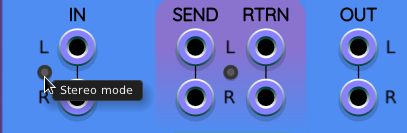
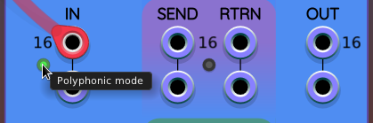
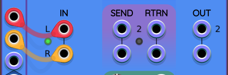
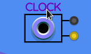

## Echo

**Sapphire Echo** is a customizable multi-tap delay that lets you build your own unique delay setup, one tap at a time. It’s made up of three modules: the main **Echo** module, the **Echo Tap** expander, and the **Echo Out** expander. While the tap and output modules are technically expanders, they connect seamlessly—just place them to the right of the main module, and they’ll automatically integrate into the system.

When you first add the Echo module from the module browser, Echo Out is added automatically, so you’re ready to start using the delay right away without having to manually build the whole chain.

Echo supports two routing modes: **Serial** and **Parallel**.

In **Serial** mode, the taps are connected in a chain—each one feeds into the next, and the last tap loops back to the beginning, creating a circular feedback path.

In **Parallel** mode, all taps receive the signal independently and play back at the same time, without interacting with each other.

You can switch between Serial and Parallel mode, but this only becomes relevant when you have **more than one tap** in your chain.

### Echo (Main Module)
The Echo module already comes with one built-in tap and includes global controls that affect the entire delay setup.

#### FDBK (Feedback)
This control adjusts how much signal is sent back into the delay chain.
In Serial mode, it controls the amount of audio fed from the last tap back into the first.

In Parallel mode, it influences the feedback level for each tap individually.

There’s a dedicated CV input and attenuverter (±5V) for modulating feedback, so you can animate or shape the feedback dynamically.

#### FRZ (Freeze)
This button freezes the buffer across all taps, preventing new audio from being recorded while preserving the contents of the delay buffers.
The freeze length depends on the delay time set on each tap.

FRZ has a **gate input**: when the gate is high, the buffers remain frozen. However, you can press the FRZ button to toggle behavior. See [exclusive-OR logic on toggle buttons](#exclusive-or-xor-logic-on-toggle-buttons) for more details.

You can switch the input to trigger mode (via right-click on the input or the module) to toggle the freeze on and off with a single pulse—one trigger turns it on, the next turns it off.

#### CLR (Clear)
This button clears the buffers of all taps, instantly erasing the stored audio.
Useful for starting fresh or creatively replacing what’s currently in the delay loop.

CLR has a dedicated trigger input, allowing you to clear buffers rhythmically or based on another event in your patch.

#### CLOCK
You can sync your delay taps to an external clock using this input. There are two helpful buttons nearby:
* **Toggle all clock sync**: enables or disables sync for all taps at once.
* **Snap to musical intervals**: lets you choose musical divisions like eighth notes, dotted eighths, triplets, and more for synced delay times. This makes it easier to stay in rhythm without dialing in values manually.

#### IN (Input)
This is your audio input. It’s **stereo**, with the left input normalled to the right if you're using only one cable. Echo also supports **polyphonic** signals of up to 16 channels.

There’s a toggle button between the ports to switch between **Stereo mode** and **Polyphonic mode**:

In **Stereo mode**, mono or stereo signals are processed normally. If you send polyphonic signals here, they’ll be summed and treated as mono. See [Polyphonic Operation](#polyphonic-operation) for more technical details.

In **Polyphonic mode**, the left input accepts a polyphonic signal and the left output on Echo Out will send out a processed polyphonic signal. The Send/Return paths will also operate in polyphonic mode, enabling deeper per-voice processing.

#### Initialize Entire Chain
This button resets all settings on Echo, Echo Tap, and Echo Out, returning the whole system to its default state. Useful for starting over or saving time when building a fresh delay patch.

### Echo Tap (Expander Module)
Echo Tap is where you add and control individual delay taps. Each tap is identical in terms of features, and you can add as many as you want by clicking the small arrow in the upper right corner of the module.
New taps are cloned from the one you used to add them, copying its settings for consistency. When you add a tap, any modules to the right (including Echo Out) will automatically shift over to make space.

#### REV / FLP (Reverse and Flip)
Each tap has a REV button to reverse the playback direction for that specific tap.
By default, REV does not enter the feedback path—it only affects playback from that tap.

REV has a gate input (high = reversed), and you can switch it to trigger mode via the context menu or right-clicking the input. If you click the REV button, the gate input must be low for the tap's audio output to be reversed. See [Exclusive-OR logic on toggle buttons](#exclusive-or-xor-logic-on-toggle-buttons) for more details.

You can click the REV label to switch to FLP mode (Flip).
Flip behaves differently—it reverses the signal within the feedback loop, not just on playback.

In **Serial mode**, that reversed signal continues through the rest of the taps.

In **Parallel mode**, it creates a kind of ping-pong effect where the tap plays forward once, then reversed on the next pass (depending on your feedback amount). It’s a great way to add movement and variety.

#### TIME

This sets the delay time for the tap, from 0.1 seconds up to 10 seconds.
You can choose whether each tap is free-running or clock-synced by right-clicking the TIME knob.

Having a mix of synced and unsynced taps can create very organic, interesting textures.

TIME has a 1V/Oct CV input with an attenuverter, allowing for expressive modulations.

#### PAN

This controls the stereo placement of the tap’s output.
Panning happens after the feedback loop, so it doesn’t affect how audio flows through the taps—just where each one lands in the stereo field.

PAN has its own CV input and attenuverter (±5V), great for spatial modulation.

#### LEVEL

Sets the volume of the individual tap.
Like panning, level changes happen outside the feedback loop, so they won’t alter the internal audio chain.

Level also has a CV input and attenuverter (±5V), making it easy to animate dynamically.

#### MUTE and SOLO

These buttons are especially helpful when dialing in or tweaking a specific tap.
MUTE silences that tap.

SOLO mutes all others so you can focus on one tap’s behavior or processing.

#### SEND / RTRN (Send and Return)

Every tap has its own send and return ports, which open the door to powerful per-tap processing chains—reverb, filtering, distortion, whatever you want. You can even send taps into one another or into external FX chains.

There are two operating modes:
* **Send/Return before delay**: processed signal continues through the delay chain to the next tap.
* **Send/Return after delay**: processed signal stays local to that tap—useful for effects that should stay isolated.

Want to process a tap externally without routing the result back into the delay loop? Just plug a dummy cable into the RTRN port to keep the signal from re-entering.

#### ENV / DCK (Envelope Follower and Ducking)
Each tap has an **envelope follower output** that tracks the signal's amplitude. Use it to modulate VCAs, filters, or effects elsewhere in your patch.

* You can adjust the envelope level using the **gain knob** next to the output jack.
* By default, this output is **monophonic**, but you can switch to **polyphonic envelope** output in the context menu.

Clicking the **ENV** label toggles it to **DCK (Ducking)** mode.
In this mode, the envelope is inverted: loud audio produces a lower voltage.

This is useful for classic ducking effects—automatically lowering the volume of another signal when this tap plays, for instance, using a VCA.

#### Initialize this tap only

Resets just the selected tap to its default settings, leaving the others untouched.

#### Remove tap

Once you have more than one tap, an arrow will appear in the lower-left corner of each. Use this to remove a tap—any modules to the right will shift left automatically to close the gap.

### Echo Out (Expander Module)

**Echo Out** is always added automatically when you place the Echo module in your patch. Just make sure it stays to the right of the last Echo Tap module. If you add or remove taps, Echo Out will automatically shift to the correct position.

#### Mix
Sets the overall wet/dry balance.
All the way left = dry signal only.

All the way right = fully processed signal only.

Mix has its own **CV input** and **attenuverter** (±5V), so you can automate the wet/dry blend, create dynamic swells, or modulate it based on performance gestures.

#### Level
Controls the overall output volume of Echo—both dry and wet combined.
This helps you dial in the right gain staging, and can also act as a global VCA.

Great for fading in/out the entire effect.

Level has a **CV input** and **attenuverter** (±5V).

#### Out
Stereo output of the entire Echo chain.
In **Polyphonic mode**, only the **left output** will carry the polyphonic signal.

#### Context Menu Options
Many features can be accessed by **right-clicking** on the Echo, Echo Tap, or Echo Out modules. A few additional options are only available this way:

* **DC reject cutoff**: Applies a low-pass filter to remove DC offset from the input signal.
* **Polyphonic envelope output**: Toggles between monophonic and polyphonic modes for the envelope follower on the current tap.
* **Toggle polyphonic/mono on all envelope followers**: Changes the envelope output mode globally across all taps.
* **Interpolator**: Adjusts audio quality. Higher settings sound better but use more CPU.

### Advanced Topics

#### Polyphonic Operation

When polyphonic operation is enabled with the [stereo/polyphonic button](#in-input), the entire Sapphire Echo signal chain operates with anywhere from 2 to 16 channels. Polyphony is then enabled on the **L** audio input, all CV inputs, all send/return **L** ports, and the **L** output audio port.

In polyphonic mode, whatever cable you hook up to the **L** input port determines the polyphonic channel count throughout the Echo chain. If the **L** port is left unconnected, the Echo chain defaults to polyphonic stereo: 2 channels on each audio **L** port.

Even in polyphonic mode, Echo will allow a pair of monophonic cables to serve as stereo input, for convenient workflows. Notice the input audio labels still show **L** and **R**, instead of the number **2**, to indicate conventional stereo operation:

Sapphire Echo internally includes 16 independent delays per tap. So even the **TIME** control can accept polyphonic CV input, causing each channel to have a different delay time.

The input ports for FRZ (freeze) and CLR (clear) are **not** polyphonic. They sum input channels to a single value and apply the result uniformly across all channels, and across the entire signal chain.

**CPU usage** increases with the number of **channels**, and with the number of **taps**. Use VCV Rack's [F3 key](https://vcvrack.com/manual/KeyCommands) to watch CPU usage. Each Echo, Echo Tap, and Echo Out module in the chain is a separate module with independent CPU statistics. To understand the overall CPU burder of the chain, you can add all the percentages together.

#### Exclusive-OR (XOR) logic on toggle buttons

When controlling the FRZ or REV controls using **gate mode** input voltages, you can click the associated push-button to toggle whether the gate must be high or low in order for the control to be active, that is, for the button to glow and the control to freeze or reverse audio. This is known as "exclusive-OR" or "XOR" boolean logic. This feature is handy to provide more flexibility in how you use your gate inputs.

In **trigger mode**, pressing the button toggles the current state of the control, just like another trigger had arrived on the input port.

#### V/OCT input for CLOCK

By default, the CLOCK input port on the Echo module operates using pulses. The amount of time between consecutive rising edges (Schmitt logic transition from below 0.1V to above 1V) is used to determine the base delay time. Each tap's TIME control group is multiplied to the base delay time to produce the delay time for each tap/channel.

However, for more agile control of the playback rate (and hence artifacts caused by changing the tap speeds), you can click on the CLOCK label and toggle it to V/OCT:

V/OCT uses zero volts (0&nbsp;V) to represent 1&nbsp;Hz. Every unit volt increase doubles the frequency. Every unit in the negative voltage direction cuts the frequency in half.

As always, the delay time is clamped to the range 0.1 seconds to 10 seconds. When converted to frequency, this means the allowed frequency range is:

* 0.1 seconds &rarr; 10 Hz
* 10 seconds &rarr; 0.1 Hz

This means the usable range of the V/OCT input port is $\pm \log_2(10) \approx \pm3.32$ octaves, and thus the same number of volts. Voltages outside that range are valid but are clamped to the range.

The reason V/OCT is more agile is that you can immediately change its value and the delay time will immediately start to adjust toward that new value (think of a physical tape drive with angular momentum speeding up or slowing down the reels/capstans).

However, in CLOCK mode, Echo never knows the pace has changed until it receives the next pulse. Echo thus knows later that the pace has changed, compared to V/OCT mode, thus delaying its corrective response.
