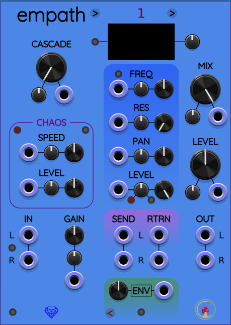
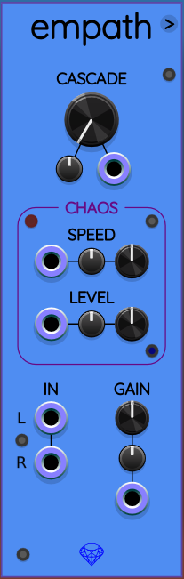

# Empath

Empath is a customizable bandpass/notch/comb filter module that lets you build your own unique filter chain. It’s made up of three modules: the main Empath module, the Empath Filter expander, and the Empath Out expander. While the filter and output modules are technically expanders, they connect seamlessly—just place them to the right of the main module, and they’ll automatically integrate into the system.
When you first add the Empath module from the module browser, a filter and output modules are added automatically, so you’re ready to start using the chain right away without having to manually build it.

---

## Empath (Input Module)

The input module is on the left side of the Empath expander chain. It contains stereo input ports, an input GAIN control, a CASCADE control, and a group of CHAOS controls.

**IN (Input)**: These are input ports where you connect your input audio. Empath is optimized for stereo, with the left input normalled to the right if you're using only one cable. Empath also supports polyphonic signals of 2..16 channels on the left input port.

**CASCADE:**  This control lets you "add" filters in series, for every filter expander, which will accentuate the cutoff slope. The higher the cascade, the narrower the slope.
There’s a dedicated CV input and attenuverter (±5V) for modulating cascade, so you can animate or shape it dynamically.

**GAIN**: This control allows you to increase or decrease the input audio amplitude as it flows into Empath. It has a dedicated CV input and attenuverter (±5V).

There’s a toggle button between the input ports to switch between stereo mode and polyphonic mode: In stereo mode, mono or stereo signals are processed normally. If you send polyphonic signals to either or both ports, they will be summed and treated as mono to each port.

In polyphonic mode, the left input accepts a polyphonic signal and the right input is not used. In this configuration, the left output port on Empath Out provides polyphonic audio output. The Send/Return paths will also operate in polyphonic mode, enabling deeper per-voice processing. The right output and send ports always provide a single channel of 0V silence when in polyphonic mode.

**CHAOS:** This box contains controls for a built-in chaotic modulation source that is internally routed throughout the Empath chain. These controls allow you to manage the behavior of the chaos generator. Chaotic modulation is available for every control with an attenuverter, except for the LEVEL control inside the CHAOS box itself.

By adjusting the a parameter's attenuverter knob, you can adjust the modulation amount. You can break this internal connection by simply connecting a different modulation source to the CV input. Any cable connection will override the internal chaos and replace it with whatever voltage signals that cable is carrying. You can use chaos (without cable) or voltage (with cable), but not both.

* **SPEED**: This control adjusts the rate of the chaotic source's movement. It has a CV input port and an attenuverter knob (±5V). (Tip: the chaotic source is also internally routed to the Speed control, so you can make the speed itself vary chaotically).
* **LEVEL**: This will control the global level of the chaotic source. It has a dedicated CV input and attenuverter (±5V). Usually you can leave LEVEL at its default setting of 0&nbsp;dB, and adjust it a little up or down to globally increase or decrease how much chaotic signals are affecting all the controls whose attenuverter is not set to zero. Setting LEVEL to zero essentially removes chaos from the entire patch.

Three corners in the CHAOS box have buttons:
* **Randomize Chaotic CV** (upper left corner): Pressing this button instantly randomizes the chaos generator across the expander chain.
* **Mono/Stereo** (upper right corner): Toggles between mono and stereo modes. When set to mono, the same chaotic signal will influence both the left and right channels. When set to stereo, however, the left and right channels will each get their own unique chaotic source, allowing you to add stereo movement, or process two different signals in the left and right inputs. When the input has more than 2 channels, stereo mode will apply one chaotic signal to every even channel (0, 2, ... 14), and a different signal to every odd channel (1, 3, ... 15). This generalizes stereo operation where channel 0 is left and channel 1 is right.
* **Freeze** (lower right corner): This button toggles between running or freezing chaotic movement. When chaos is frozen, all the chaotic signals stop changing their voltages. You can use the freeze button as part of your performance. If you don't want to use Empath's internal chaos in a particular patch, **freezing chaos reduces CPU** usage.

**Initialize Entire Chain**: This button in the bottom left corner of the panel resets all settings on Empath, Empath Filter, and Empath Out, returning the whole system to its default state. Useful for starting over or saving time when building a fresh filter setup.

---

## Empath Filter (expander module)

Empath Filter is where you add and control individual filter. Each filter is identical in terms of features, and you can add as many as you want by clicking the small arrow in the upper right corner of the module.

By default, new filters are cloned from the one you used to add them, copying its settings for consistency.

When holding Shift while clicking the Add filter arrow button, the new filter will be added with default settings. When holding Ctrl (Cmd on Mac) while clicking the Add filter arrow button, the new filter will be added with the Level control all the way down.

You can combine both modifiers to add filter expanders that have default settings, but also the Level control all the way down. When you add a filter, any modules to the right (including Empath Out) will automatically shift over to make space.

### Spectrum Graph

With the spectrum graph, you can visually see the effect of the filter you’re using, per expander.

**Graph mode button**: You can change the channels of the graph with the button on the left between Mono, and Polyphonic. When using a stereo signal, Polyphonic mode will show you the left and right separately.
Vertical Scale: With this control, you can change the scale of the graph lines.

**FREQ**:
This control sets the center frequency of the filter. It has a dedicated CV input and attenuverter (±5V).

**Filter mode button**: With this button, you can change the filter between a band-pass and a notch/comb.

**RESONANCE / MORPH**:
By default, this sets the resonance of the filter. When set to notch/comb, the Resonance control turns into a Morph control that allows you to morph between a notch filter and a comb filter. All the way left, it’s a notch, and all the way right, it’s a comb filter. This control has a dedicated CV input and attenuverter (±5V).

**PAN**:
This controls the stereo placement of the filter’s output. PAN has its own CV input and attenuverter (±5V), great for spatial modulation.

**LEVEL**:
Sets the volume of the individual filter. Level also has a CV input and attenuverter (±5V), making it easy to animate dynamically.

**MUTE and SOLO**:
These buttons are especially helpful when dialing in or tweaking a specific filter.
MUTE silences that filter.
SOLO mutes all other filters so you can focus on one filter’s behavior or processing.

**SEND / RTRN (Send and Return) ports**:
Every filter has its own send and return ports, which open the door to powerful per-filter processing chains—reverb, filtering, distortion, whatever you want. You can even send filter into one another or into external FX chains.
Want to process a filter externally without routing the result back into the filter setup? Just plug a dummy cable into the RTRN port to keep the signal from re-entering.

**ENV / DCK (Envelope Follower and Ducking)**:
Each filter has an envelope follower output that tracks the signal's amplitude. Use it to modulate VCAs, filters, or effects elsewhere in your patch.
You can adjust the envelope level using the gain knob next to the output jack.
By default, this output is monophonic, but you can switch to polyphonic envelope output in the context menu.

Clicking the ENV label toggles it to DCK (Ducking) mode.
In this mode, the envelope is inverted: loud audio produces a lower voltage.
This is useful for classic ducking effects—automatically lowering the volume of another signal when this filter plays, for instance, using a VCA.

**Initialize this filter only**:
Clicking this button at the bottom of a filter resets just that filter to its default settings, leaving the others untouched.

**Remove filter**
In the lower-left corner of each filter is a button with a red <code>&lt;</code> symbol on it. Click this button to remove the filter. Empath modules to the right will shift left automatically to close the gap.

---

## Empath Out (Expander Module)
Empath Out is always added automatically when you place the Empath module in your patch. Just make sure it stays to the right of the last Empath Filter module. If you add or remove filters, Empath Out will automatically shift to the correct position.

**MIX**:
Sets the overall wet/dry balance.
All the way left = dry signal only.
All the way right = fully processed signal only.

Mix has its own CV input and attenuverter (±5V), so you can automate the wet/dry blend, create dynamic swells, or modulate it based on performance gestures.

**LEVEL**:
Controls the overall output volume of Empath, both dry and wet combined.
This helps you dial in the right gain staging, and can also act as a global VCA.
Great for fading in/out the entire effect.

LEVEL has a CV input and attenuverter (±5V).
There is a built-in compressor/limiter on the output level to prevent the signal to be too loud at the output. When it’s active, the LEVEL knob will turn red. By default, it’s set to 6V, but you can change this by right-clicking the LEVEL knob, and even turn it completely off. You can also just turn off the warning light.

**OUT**:
Stereo output of the entire Empath chain. In Polyphonic mode, only the left output will carry the polyphonic signal.

**Context Menu Options**:
Interpolator: Adjusts audio quality. Higher settings sound better but use more CPU.
