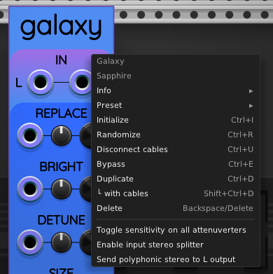

## Galaxy

Galaxy is a clone of the Airwindows Galactic stereo reverb by [Chris Johnson](https://github.com/airwindows/airwindows).

Galactic is also available for VCV Rack in the consolidated
[Airwindows Suite](https://library.vcvrack.com/Airwin2Rack/Airwin2Rack)
along with many other filters and effects, all combined into one module.

My automatic unit tests verify that Sapphire Galaxy and Airwindows Galactic
produce identical output when given the same settings and stereo audio inputs.

### Demo videos

### Control groups

Let us call the combination of a larger parameter knob, a smaller attenuverter knob,
and a CV input port a *control group*. Galaxy includes the following control groups:

* **REPLACE**: The fraction of the reverb's energy that should be replaced by each input sample. If you set REPLACE to 0, it "freezes" the contents of the reverb tanks indefinitely. If you set REPLACE to 1, new audio input quickly replaces the contents of the reverb tanks.
* **BRIGHT**: Adjusts treble by changing the cutoff frequency of an internal low-pass filter in the reverberated signal.
* **DETUNE**: Adds different amounts of stereo phase distortion between the left and right output channels. Lower values sound "purer" but also flatter in the stereo field. Higher values sound more dissonant. Somewhere between can provide a nice chorus effect with a lush stereo field.
* **SIZE**: Adjusts the reverb tank sizes. **NOTE**: You might not want to adjust SIZE during a performance, because there is a noticeable zipper noise. People usually experimentally determine a size for their performance and leave it there. (Don says: *Yes, I have tried to fix the zipper noise, and no, I haven't figured out how yet. Sigh.*)
* **MIX**: Galaxy's outputs result from a linear mix of the reverberator's output and the original input. The MIX knob adjusts what fraction of the output is from the reverb tanks. If you set MIX to 0, the output is the same as the input (delayed by one sample). If you set MIX to 1, the output is entirely derived from the reverb tanks. Lower values work well for adding ambience to a foreground voice or percussion. Higher values work well for creating synth pads or choir effects.

### Inputs and outputs

Galaxy has two audio input ports at the top of the panel, L and R.

Likewise, there are two audio output ports at the bottom also labeled L and R.

You can provide mono (1-channel) or stereo (2-channel) input,
and the output will have an easily audible stereo field either way.

To provide mono input, connect your audio cable to the left input L **or** the right input R.
When only one of the inputs is connected to a cable, Galaxy will send half the voltage
on that cable to both the left and right reverb inputs. The voltage is divided by 2
to preserve the same general volume level as mono input would if fed to a single channel.

To provide stereo input, connect one cable to L and one cable to R.

Polyphonic input cables are summed across channels to provide
a monophonic input signal for the port they are plugged into.
This is true for the two audio input ports and all 5 CV input ports.

Galaxy's left and right audio output ports are each monophonic by default,
but there is a [polyphonic output](#send-polyphonic-stereo-to-l-output) option.

### Context menu

The right-click context menu for Galaxy looks like this:

### Toggle sensitivity on all attenuverters

Galaxy supports [low-sensitivity attenuverters](LowSensitivityAttenuverterKnobs.md).
This option toggles the sensitivity mode on all the attenuverter knobs.

### Stereo splitter option

The option "Enable input stereo splitter" overrides the audio input behavior
described above, but only when a polyphonic cable is connected to either
L or R. For the stereo splitter to work, the opposite port must remain unconnected.

If the single audio input cable has 2 or more channels, and the stereo splitter
option is enabled, the first channel is sent to the left input and the second
channel is sent to the right input. Any remaining channels are ignored.

The purpose of this option is to support a stereo input provided by a single
cable, which can eliminate the need for a dedicated splitter module between
the signal and Galaxy.

### Send polyphonic stereo to L output

When checked, this option causes stereo output to go to the L output only.
The output is polyphonic with 2 channels, with channel 0 as the left
output and channel 1 as the right output.

Enabling polyphonic stereo output causes the output port labels to change from "L" and "R"
to a "2" displayed on the left output port only.

