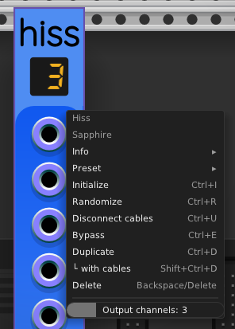

## Hiss

Sapphire Hiss is a vector noise generator. Unlike most noise generators,
the output of Hiss is a stream of N-dimensional vectors that point
in any direction in space with equal likelihood.

A naively constructed vector generator will produce vectors that
too often point along diagonals of the coordinate axes,
or some other such artifact of the coordinate system will distort
the uniformity of the probability distribution.

Each component of the generated vectors (that is, the voltage of
each channel of the polyphonic output) follows a normal distribution
with a mean value of 0&nbsp;V and a standard deviation of +3&nbsp;V.
Using a normal distribution guarantees a completely unbiased vector
in any N-dimensional space. See
[this article I wrote on Medium](https://medium.com/towards-data-science/the-best-way-to-pick-a-unit-vector-7bd0cc54f9b)
that explains the math in detail.

Each output vector is delivered by a polyphonic output port.
The default number of channels is 3, because Hiss is designed
for convenient use by many Sapphire modules that operate in 3D space
using 3-channel polyphonic cables as carriers.

Using the "Output channels" slider in the right-click context menu,
you can change the output channel count to any value from 1 to 16:

