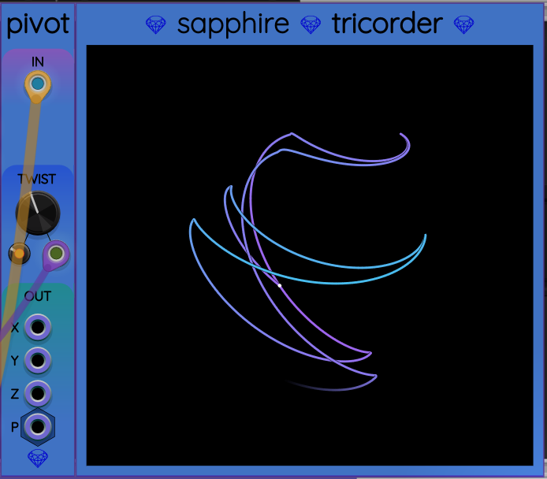

## Pivot

Pivot receives a 3D input vector, twists it by a CV-adjustable angle,
and outputs the result as another 3D vector.
This module, in combination with [Frolic](Frolic.md), [Glee](Glee.md), and [Rotini](Rotini.md),
can create an unlimited number of chaotic control signals for modulating generative
movement in your patches.

## Input port

Pivot receives a 3D vector through the input port labeled `IN`.
A connected cable should usually be polyphonic with 3 channels,
but any missing channels will default to zero volts.
Any channels beyond the first three will be ignored.
When no cable is connect to `IN`, the input is treated as (0,&nbsp;0,&nbsp;0).
The 3 voltages represent the coordinates of a vector in 3D space.

## Operation

Pivot rotates the coordinate frame around the diagonal axis that passes
through both (0,&nbsp;0,&nbsp;0) and (1,&nbsp;1,&nbsp;1). This axis was chosen because it
cycles through the coordinate axes using the right-hand rule:
the point (x,&nbsp;y,&nbsp;z) can be replaced with (y,&nbsp;z,&nbsp;x) or (z,&nbsp;x,&nbsp;y) when the twist angle is 120&deg; or 240&deg; respectively.
There is a continuum of other orientations for angles between these values.

## Twist angle

The twist angle is controlled by the `TWIST` control group consisting of a large manual knob,
a small attenuverter knob, and a CV input port.

The twist angle is expressed in one unit per 120&deg;, so that each unit represents
another exact cycling of the input's coordinates. The default twist is 0, which leaves
the input vector as-is. The allowed range of values is [&minus;3,&nbsp;+3]. This range allows
wide bipolar CV oscillation around each of the 3 axes: x, y, and z.

Here are examples of output vectors for different integer TWIST values:

* &minus;3 &rarr; (x, y, z)
* &minus;2 &rarr; (y, z, x)
* &minus;1 &rarr; (z, x, y)
* &nbsp;&nbsp;0 &rarr; (x, y, z)
* +1 &rarr; (y, z, x)
* +2 &rarr; (z, x, y)
* +3 &rarr; (x, y, z)

## Output ports

The output of Pivot is a 3D vector, provided two ways:

* The monophonic outputs `X`, `Y`, and `Z`. These ports support [voltage flipping](VoltageFlipping.md).
* The 3-channel polyphonic output `P` in the format `(X, Y, Z)`.

## Vector graphing with Tricorder

You can place a [Tricorder](Tricorder.md) immediately to the right of a Pivot to graph
its output. Having a 3D oscilloscope helps you better understand the signal.

