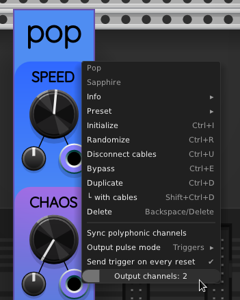

## Pop

Sapphire Pop is a polyphonic trigger/gate generator that can simulate the statistical
behavior of radioactive decay, or generate completely regular pulses,
or anywhere on a spectrum between these extremes.

## Context menu

When you right-click on Pop's panel, the following context menu appears:

It allows you to perform the following actions:

## Sync polyphonic channels

This is a manually operated counterpart to the [SYNC trigger input](#sync-trigger-input).
Each time you select this menu action, Pop syncs the output channels the same way the trigger input does.
This menu action is provided to save space in your patch when you want to manually sync,
so that you don't have to add an external button module.

## Output pulse mode

You can select whether the [PULSE output port](#pulse-output) should produce triggers or gates.
By default Pop outputs triggers.

## Send triggers on every reset

By default, Pop does not send an initial trigger when reset.
Instead, it waits a random amount of time to trigger.
Enabling "Send triggers on every reset" causes an initial trigger
every time the a trigger is receivedon the SYNC input port.

## Output channel count

The output channel count slider in the context menu allows you
to select a number of channels in the range 1..16. By default, Pop outputs
a pulse trigger that has a single channel. By changing this slider setting,
you can tell Pop to output up to 16 polyphonic channels from the PULSE port.
This results in up to 16 independent pulse generators.
The LED-style numeric display on the panel indicates the current number of output channels.

## SPEED control group

The SPEED knob ranges from &minus;7 to +7. The default value is 0, which results
in a mean pulse rate of 2&nbsp;Hz. This frequency was chosen to match
the default frequency of the [VCV LFO](https://library.vcvrack.com/Fundamental/LFO).

Each time you increase the SPEED by 1, it doubles the mean pulse frequency.
In other words, just like a V/OCT input, every volt represents an octave.
Therefore, you can increase the speed by a factor of $2^7=128$ by turning the SPEED
knob all the way to +7. This results in a mean pulse rate of 256&nbsp;Hz.
If you turn SPEED all the way down to &minus;7, the effective frequency is $2^{-6}=\frac{1}{64}$ Hz,
resulting in less than one pulse per minute on average.

To use the SPEED CV input as a V/OCT control, set the attenuverter all the way clockwise to +100%.

## CHAOS control group

When the CHAOS knob is turned all the way to 1 (its maximum value),
Pop produces output pulses with completely random timing, using
[Poisson distribution](https://en.wikipedia.org/wiki/Poisson_distribution)
statistics for radioactive decay.

When CHAOS is set to its minimum value of 0, the pulses occur as exactly fixed intervals
based on the SPEED control.

Intermediate values of CHAOS perform a linear interpolation between completely regular
timing and completely random timing.

## SYNC trigger input

When a monophonic cable is connected to the SYNC input port, a trigger received on that
port causes all 1..16 polyphonic Pop engines to restart in sync.
This can be useful when CHAOS is set to a value very close to zero,
in order to bring all the output PULSE channels to a common starting point.

A polyphonic SYNC cable allows independent control of sync timing on each output engine.
The final channel in the cable "normals forward" to all remaining pulse channels.
Therefore, the monophonic case isn't actually special: the single supplied channel
normals forward to all 1..16 pulse engines.

You can also manually sync using the [Sync polyphonic channels](#sync-polyphonic-channels)
action in the right-click context menu.

## PULSE output

PULSE is a polyphonic output port. You can select from the available output modes
in the [context menu](#context-menu):

* **Triggers**: Most of the time, each channel voltage is zero.
When a pulse occurs on channel, the voltage immediately jumps to 10&nbsp;V and stays
there for one millisecond. Then the voltage goes back to 0&nbsp;V for another millisecond. After that, a pulse can occur again at any time. This results in a maximum possible
instantaneous pulse rate of 500&nbsp;Hz, even though the mean pulse rate is clamped to 256&nbsp;Hz.
* **Gates**: In gate mode, the output starts at zero volts. Every time a pulse occurs, the output is toggled between 0&nbsp;V and +10&nbsp;V. This results in a series of gates that occur between every alternating pair of pulses. The maximum mean square wave frequency is thus half the maximum mean pulse rate, i.e., 128&nbsp;Hz.

## Polyphonic CV

The SPEED and CHAOS control groups each consist of a large manual knob, a small attenuverter knob,
and a control voltage (CV) input port.

The SPEED and CHAOS CV input ports are both polyphonic. Just like the SYNC trigger input port,
you can independently control the 1..16 pulse engines using a polyphonic cable with the correct
number of channels. Just as the SYNC trigger does, the final channel value on a CV input port
normals forward to all remaining channels.
