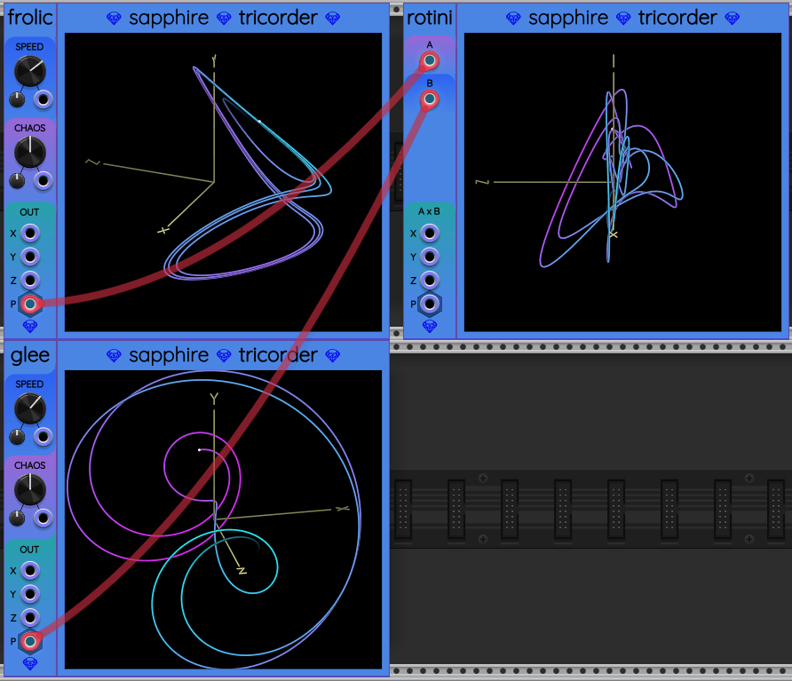

## Rotini

Rotini is a utility module that calculates the 3D vector cross product
of two input 3D vectors. Vectors are represented by polyphonic cables with 3 channels.
If fewer than 3 channels exist, the values of the missing channels are considered to be 0&nbsp;V.

Rotini can combine the outputs of one [Frolic](Frolic.md) or [Glee](Glee.md) with another Frolic or Glee, to produce a more complex 3D vector signal. The signal can be used to drive movement in a generative patch.

My hope is that with combinations of Frolic and Glee fed through Rotini, modular artists
will have an unlimited toolbox of complex chaotic oscillators.

## Input Ports

Rotini receives a pair of 3D vectors as input, named A and B.
Each input port is designed to receive a polyphonic cable with 3 channels,
representing the x, y, and z coordinates of a vector, such as the P output
from [Frolic](Frolic.md) or [Glee](Glee.md). Here is an example:

## Output Ports

Rotini calculates the vector cross product of the two vectors, producing a third vector A&times;B that is perpendicular to both A and B. The resulting cross product vector has X, Y, and Z components. These go to the X, Y, and Z ports respectively.

The X, Y, and Z output ports support [voltage flipping](VoltageFlipping.md).

The entire cross product as a 3D vector comes out of Rotini's P port. This is always a 3-channel polyphonic signal in the format (X, Y, Z).

The vector output P can be sent to [Tin](Tin.md) for graphing by [Tricorder](Tricorder.md).
Alternatively, Tricorder can directly serve as an extender module to the right of Rotini,
as seen in the screen shot above.

Both monophonic X, Y, Z and polyphonic P are provided to eliminate the need for external split/merge modules.

## Ideas

One Rotini's P output can be chained to another Rotini's A or B input. There are endless combinations of chained trees of Frolic, Glee, and Rotini, each set to different speed and chaos settings.
Therefore, there is no limit to the number of distinct chaotic paths you can create!
This was the real motivation to create and release Rotini: it greatly expands the number of chaotic curves we can create using a few simple modules.
