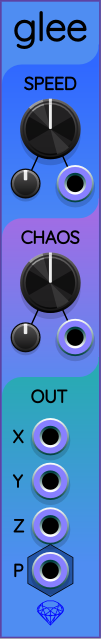

# Sapphire chaos modules

The Sapphire plugin offers the following collection of modules that allow you to generate a wide variety of smooth control voltages. Chaotic signals are somewhere between periodic and random.

## Single-attractor modules

The modules [Frolic](Frolic.md), [Glee](Glee.md), and [Lark](Lark.md) each implement a specific chaotic attractor. See their respective documentation pages for details.

## General purpose module Zoo (advanced)

[Zoo](Zoo.md) is a user-programmable chaotic oscillator. It comes with presets that give you many more chaotic oscillators.

If you are comfortable with algebra and vectors, you can enter in your own chaotic oscillator formulas and create an unlimited variety of shapes and patterns.

