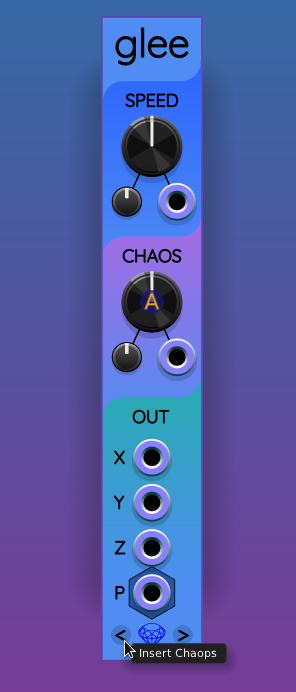
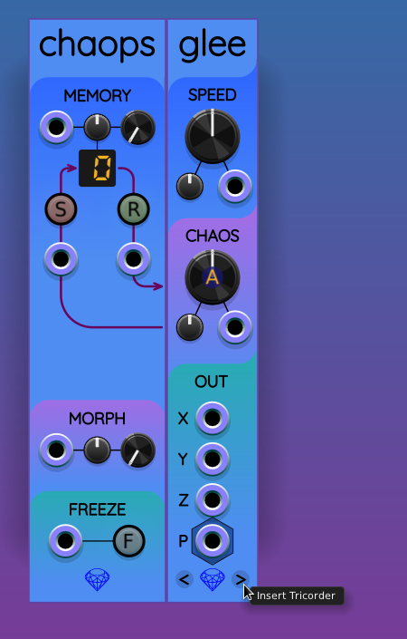
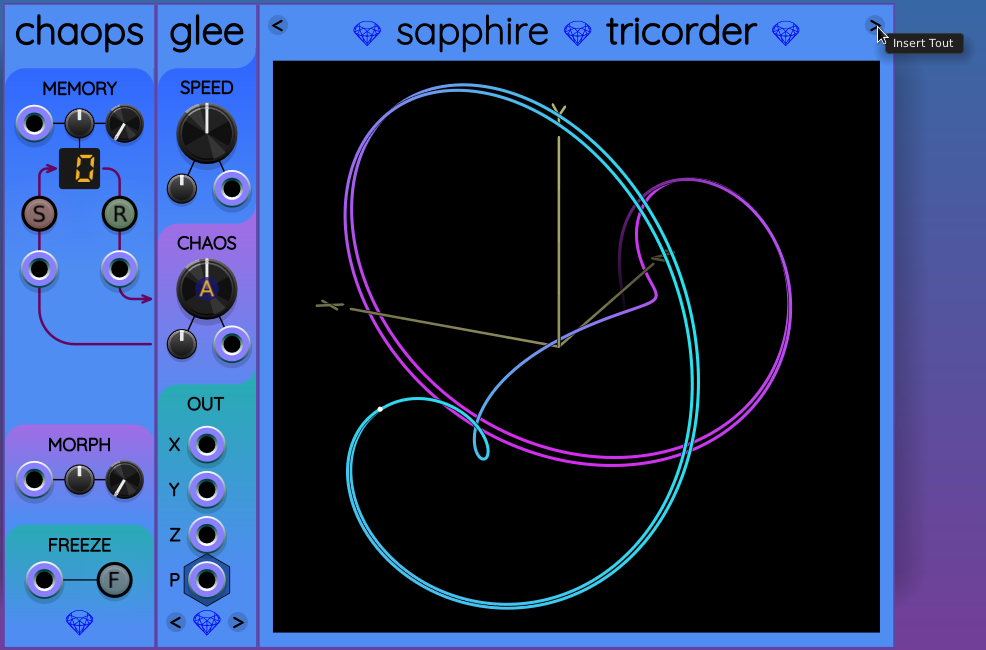

# Sapphire expander buttons

To make adding expanders simpler, many Sapphire modules now include buttons on their panels.
Look for these buttons and hover your mouse over them to find out what they do.

For example, start with Glee in a patch. Then click on the "Insert Chaops" button in the lower left.

The button creates a Chaops module on the left, ready to add extra controls to Glee.

Clicking on "Insert Tricorder" works as expected:

Now Tricorder includes buttons for inserting Tin on the left or Tout on the right. Adding Tout to the right looks like this:

