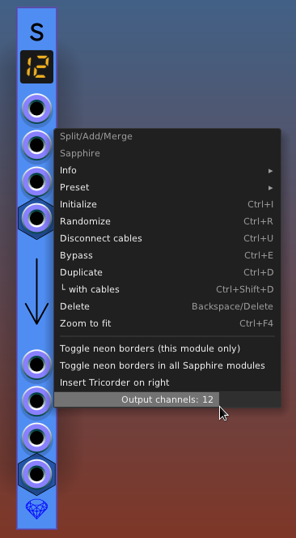
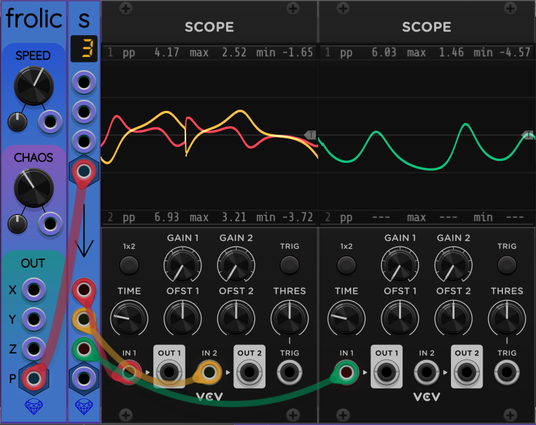
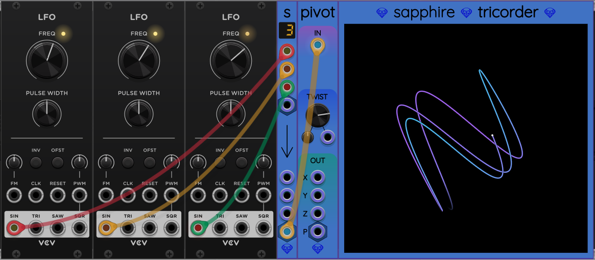
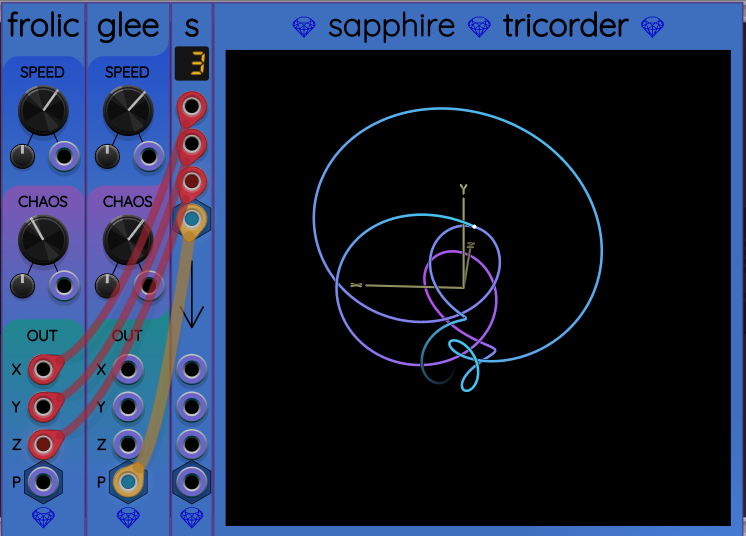

## Split/Add/Merge

This utility splits, adds, and/or merges a stereo or 3D polyphonic signal with 2 or 3 monophonic signals.
This is like VCV Merge and VCV Split combined, but only for a maximum of 3 channels.
I chose 3 as the channel limit to support 3D vectors produced by
[Frolic](Frolic.md), [Polynucleus](Polynucleus.md), etc.
SplitAddMerge saves patch screen space because it is only 2 HP wide.

I created this module to save surface area in my patches.
Often I want to merge a pair of stereo signals into a single 2-channel polyphonic cable,
so that I can multiply both by the same envelope in a VCA, for example.

Usually I would use VCV Split and VCV Merge, but they are designed for up to 16 channels
and are larger than I need.

## Channel Count

Split/Add/Merge has an adjustable channel count 1..16. Right-click on the panel and slide the horizontal bar labeled "Output channels". This slider controls the number of channels on the polyphonic output port, which is the port at the bottom of the panel.

Any channels beyond the selected channel count are discarded. Any extra channels created by the slider are set to 0 volts.

## Input Ports

The upper half of the panel includes 4 input ports.

The top 3 input ports are monophonic X, Y, and Z inputs.
Below it is a polyphonic P input.

Usually you plug monophonic cables into X, Y, or Z.
However, if any of these inputs has more than one channel, the channel voltages
are added to produce a single monophonic sum.

The polyphonic P input respects up to 3 channels in the input cable.
Any remaining channels are ignored.
Missing channels are treated as 0&nbsp;V.

## Output Ports

The lower half of the panel includes 4 output ports.

The top 3 output ports are monophonic X, Y, and Z outputs.
Below it is a polyphonic P output.
Both are different representations of the following sums:

* P[0] + X
* P[1] + Y
* P[2] + Z

Any missing inputs are treated as 0&nbsp;V, so using only the polyphonic input or only
the 3 monophonic inputs causes them to be copied to the output ports.

You can change the number of polyphonic channels in the output port P by right-clicking
on the Split/Add/Merge panel and sliding the channel count slider. The current output channel count is indicated by the LED-style numeric display in the uppper part of the panel.

## Examples

Here is an example of splitting a polyphonic 3D vector output from [Frolic](Frolic.md)
into its component voltages.

---

And here is an example of merging monophonic signals into a polyphonic signal:

---

If you provide both monophonic and polyphonic inputs, the signals get added.
This can be a handy way to create novel chaotic signals using a pair of simple chaotic oscillators.
The following example also demonstrates that you can place a [Tricorder](Tricoder.md)
immediately to the right of a Split/Add/Merge and it will graph the output vector.

## Insert Tricorder button

Split/Add/Merge has a [button to insert a Tricorder](SapphireExpanderButtons.md) graphing module to the right. This will graph whatever vector value is sent to the output.
