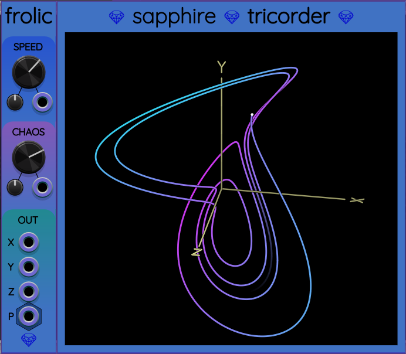
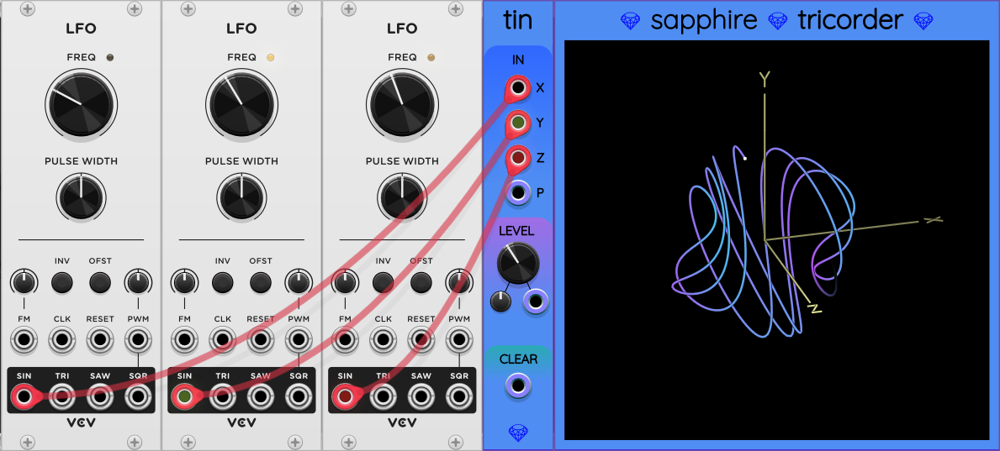
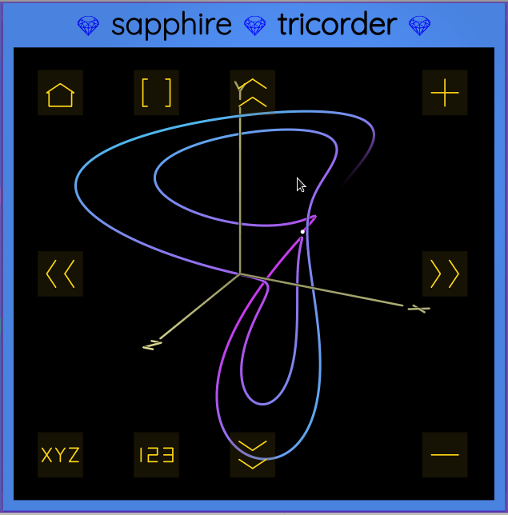
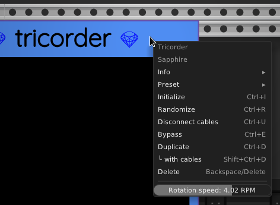

## Tricorder

Tricorder is a 3D oscilloscope designed for displaying
animations of a triplet of low-frequency voltages.

Tricorder was designed specifically as an expander module
for [Frolic](Frolic.md) and [Glee](Glee.md), but it also allows graphing
any three input voltages you want, using [Tin](Tin.md)
instead of Frolic to the left of Tricorder.
[Nucleus](Nucleus.md) and [Polynucleus](Polynucleus.md) also
allow the user to select any of the 4 output particles to
be graphed by Tricorder.

Tricorder sends any vector it receives from the left to the module on its right.
Thus you can form chains of vector streams through multiple compatible
Sapphire modules.

In general, Tricorder is useful for visually understanding the behavior
of Frolic, Glee, or any other 3D system of voltages.
Tricorder also could be a fun decoration for your patch.

The photo at the top is an example of Frolic placed to the immediate
left side of Tricorder, which causes them to "connect".
When connected, Frolic sends its (X, Y, Z) outputs
into Tricorder for graphing.

Here is an example of using [Tin](Tin.md) instead:

Three different sine waves are fed through Tin into Tricorder
to be graphed. The result is a 3D [Lissajous curve](https://en.wikipedia.org/wiki/Lissajous_curve).

### Controls

Once you have connected Tricorder to a signal source (by attaching either Frolic or Tin to its left side),
it will start graphing the signal. If you hover the mouse pointer over the display area, a group of controls
will appear:

* The double-chevron symbols (&gt;&gt;) at the left, right, top, and bottom sides of the display
allow rotating the animation in four different directions.
* The XYZ button toggles whether coordinate axes are shown.
* The 123 button toggles whether the voltage values are displayed as numbers at the bottom of the display.
* The + and &minus; buttons zoom in and out.
* The home button in the upper left corner resets the default orientation and zoom level.
* The button with empty square brackets `[]` can be pressed to clear the existing path on the display. After clicking this button, Tricorder will start over with any new vector data that are fed to it.

You can also click anywhere in the middle of the display, hold down the left mouse button,
and drag to reorient the display. This stops any automatic rotation that was in progress.
If you want to restart rotation, click one of the double-chevron buttons.

## Sample videos

Here is a video that explains the controls in more detail:

And here is another video without talking, just showing me play around with Frolic and Tricorder:

### Rotation Speed

As mentioned above, you can use the double-chevron buttons to make the graph rotate automatically.
By default Tricorder spins at 1 revolution per minute (RPM).
However, you can change the speed by right-clicking to bring up the context menu as seen here:

By sliding the "Rotation speed" bar left or right, you can adjust the rotation speed from 0.01&nbsp;RPM to 100&nbsp;RPM.

