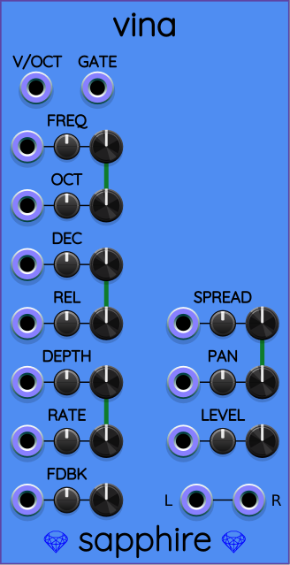
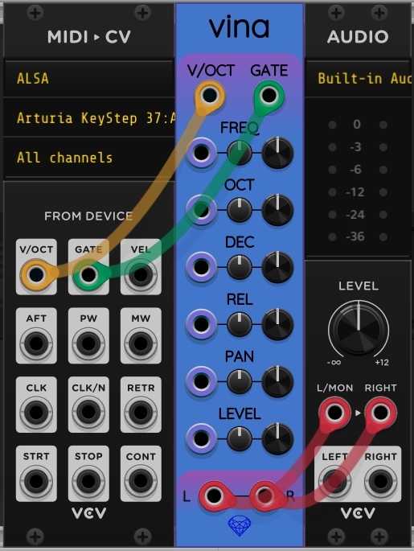

## Vina

Vina is a polyphonic stereo VCO based on a physics simulation of a plucked string.

Vina is "opinionated". It allows making a specific kind of string-like voice, rather than having many controls to modify the timbre of the voice. Think of it as a particular instrument, not a sound-design tool.

However, Vina does come with a sort of internal envelope, as a side-effect of the physics simulation it uses. You have control over the decay and release parameters. The attack in Vina is always a "pluck" effect that is rather quick.

Vina produces *polyphonic stereo* output. That means that Vina accepts polyphonic gate and V/OCT inputs to play a chord of up to 16 simultaneous notes, with each note producing a nuanced stereo field across left and right output channels. The L and R outputs each are polyphonic with the same number of channels as the maximum channel count of all input ports (including CV).

### Quick start

Vina's [physics model](#physics-model) acts like an integrated envelope generator. This means you can play a complex and real-sounding instrument with only 4 cables:

### Ports and polyphony

At the bottom of the Vina panel are two audio output ports labeled **L** and **R**. Both ports are **polyphonic** and always have the same number of channels.

All input ports are **polyphonic**. Whichever input port has the most channels controls the channel count for the output L and R ports. Exception: if no cables are connected, the the L and R output ports each have one channel.

### Attenuverters

The attenuverter knobs in Vina all include a [low-sensitivity mode](LowSensitivityAttenuverterKnobs.md) that decreases the sensitivity of the CV input port by dividing the input voltage in each polyphonic channel by 10.

### Controls

* **V/OCT**: Volt-per-octave input port. Adjusts the VCO frequency by one octave upward for each increase of 1V, or down by one octave for each decrease of 1V. Zero volts represents the musical note C4, which has a frequency of about 261.63&nbsp;Hz.
* **GATE**: Gate input port for playing Vina. A given channel's gate is active when the voltage rises above 1V and stays active until the voltage drops below 0.1V. Afterward, the gate stays inactive until the voltage rises above 1V again. The rising edge of the gate acts as a trigger that plucks the string. As long as the gate stays active, the **DEC** control (see below) determines the audio decay rate. As soon as the gate goes inactive, the **REL** control determines the audio release rate.
* **FREQ**: The frequency *control group* (combination of manual knob, attenuverter knob, and CV input port) adjusts the base frequency of the oscillator. There is a single manual knob that controls all polyphonic channels together, but the CV input port is polyphonic. In a sense, FREQ is redundant with V/OCT, but allows more flexibility for things like vibrato or glissando effects via control voltage.
* **OCT**: Another frequency control group, this time with a stepped knob (it clicks only onto integer values). The CV is also polyphonic, but the adjustment to the frequency is forced to be an integer number of octaves (1V steps).
* **DEC**: The decay control group determines how long the string sound takes to fade out while the GATE is active. Smaller values of DEC can create a percussive "plucky" sound. Larger values make Vina sound more like a piano with a lengthy sustain while the gate is held active.
* **REL**: The release control group determines how long the string is active after the GATE is released. Smaller values cause the sound to go quiet almost immediately after releasing the GATE. Larger values cause a longer-lasting decay after the GATE has been released. Also, higher values of REL cause a little extra internal reverb.
* **PAN**: Allows the stereo field to be shifted either toward the left or right output. Uses a sine/cosine combination to maintain consistent signal power $L^2+R^2$ as PAN is modulated.
* **LEVEL**: Determines the output gain. The manual knob's default center position is 0&nbsp;dB. Maximum clockwise rotation increases the gain by a factor of 8 (increase of about 18&nbsp;dB). Maximum counter-clockwise rotation silences the audio completely (multiplies by 0). You can use this control group as a **built-in VCA** for the output stage.

### Physics model

Vina is a fourth-order [Runge-Kutta](https://en.wikipedia.org/wiki/Runge%E2%80%93Kutta_methods)  (RK4) simulation of a one-dimensional series of 42 particles connected by springs. Vibration travels longitudinally only, meaning along the direction of the string and in the form of stretching and compressing the springs. The endpoints are fixed in place, and the whole string is stretched with tension while at rest. Being one-dimensional not only reduces CPU usage greatly, it actually improves the sound quality by eliminating discordant modes of vibration. Essentially, there is one primary resonant mode at a time, resulting in cleaner sounding notes.

The string is plucked by randomly picking a pair of particles along a region of the string near 1/3 its length and imparting a velocity impulse to them. Different particles are chosen on each pluck to provide a subtle variation in the sound as Vina is played. The velocity impulse itself is band-limited to keep the tone mellow and to minimize aliasing.

The string stereo output is produced by taking the position of two different particles. The position values are fed through a state-variable bandpass filter to eliminate DC at the low end of the frequency spectrum and harsh harmonics at the upper end.

Finally, the left and right signals are mixed with a tiny amount of small-chamber reverb, to produce a more realistic stereo voice by emulating the resonance of a hollow cavity, something like a guitar body. The reverb mix is increased slightly with larger values of the **REL** control, in addition to making the string itself take longer to stop vibrating after being released. Vina's internal reverb is the [Airwindows Galactic](https://github.com/airwindows/airwindows) algorithm by Chris Johnson, the same one used by [Sapphire Galaxy](Galaxy.md).

In the Vina model, pitch is controlled by changing how fast time flows. More specifically, the value of the simulated time step $\Delta t$ multiplied by a pitch scaling factor $2^p$, where $p$ is V/OCT. This keeps the simulation stable across a wide variety of frequencies, but numerical stability does require automatic oversampling at higher frequencies, conditionally increasing CPU usage.

The decay (DEC) and release (REL) parameters are inversely scaled by $2^p$, keeping the audible decay rates consistent as the pitch is changed.
