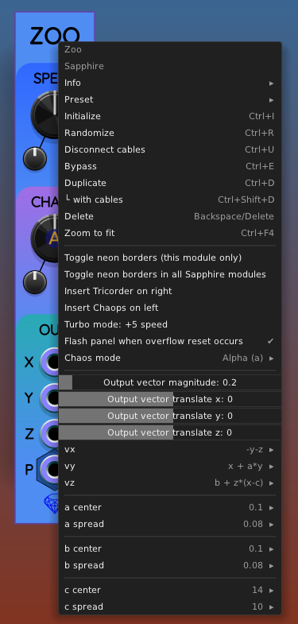

## Zoo

Zoo is a low frequency (and ultra-low frequency) chaotic oscillator
that is programmable by the user with 3 configurable math formulas.

If you don't like algebra, Zoo also comes with plenty of example factory presets,
each of which generates a distinctive chaotic output:

The default is the [Rössler attractor](https://en.wikipedia.org/wiki/R%C3%B6ssler_attractor).

### Mathematical basis

I created [Frolic](Frolic.md), [Glee](Glee.md), and [Lark](Lark.md) before Zoo.
They are all chaotic oscillators, each using a different attractor formula.
See the documentation links for the exact formulas used in each case.

All three attractor formulas follow the same pattern. In every case,
you model a particle in 3D space whose position vector is $(x, y, z)$
and whose velocity vector is $(\dot{x}, \dot{y}, \dot{z})$.
In every time step,

$$
\dot{x} = v_x(x,y,z)
$$

$$
\dot{y} = v_y(x,y,z)
$$

$$
\dot{z} = v_z(x,y,z)
$$

The functions $v_x$, $v_y$, and $v_z$ are particular to each kind of chaotic oscillator.

Zoo is a generalization of chaotic oscillators that use a particle's position to determine the direction and speed (the *velocity vector*) it must have at that moment in time. The velocity vector in turn causes a small update in position for each small time increment of the VCV Rack simulation.

### Entering formulas

Zoo's front panel looks just like Frolic, Glee, and Lark. All of the programmability options are in the right-click context menu:

The items `vx`, `vy`, `vz` are formula editors that allow you to enter in a simple algebra expression for each component of the velocity vector. You can use the operators `+`, `-`, `*`, `/`. You can also use `^` for exponentiation, but the exponent must be a constant integer 1..4.

You can use parentheses to group expressions, and the usual rules of operator precedence apply: `a+b*x` means the same as `a+(b*x)`, not `(a+b)*x`, because multiplication has higher precedence than addition.

You are allowed to use the variables `x`, `y`, `z` for the particle's position, plus up to four adjustable parameters `a`, `b`, `c`, `d`.

To find formulas, try [this list](http://www.3d-meier.de/tut19/Seite0.html) (German language). For example, [here is where I found the Halvorsen attractor formulas](http://www.3d-meier.de/tut19/Seite13.html).

### Fixing mistakes in your formulas

If you have a syntax error in one of your formulas, Zoo's output voltages will "freeze" in place. After entering a formula, if you notice the "particle" has stopped moving, right-click on the Zoo panel again to see if there is an error message. Here is an example where I made two mistakes, one in the `vx` formula and another in the `vy` formula:

The prefix `***` after `vx` and `vy` is followed by an error message that helps you figure out what went wrong.

### Chaos mode

When you right-click on the CHAOS knob (or in the main context menu shown above), you will see the following list of choices:

* Alpha (a)
* Bravo (b)
* Charlie (c)
* Delta (d)

However, you will **NOT** see one of the above if you never use the associated parameter `a`, `b`, `c`, `d` in any of the 3 formulas `vx`, `vy`, `vz`.

When you select a chaos mode like Charlie, it means the CHAOS knob now is controlling the parameter `c`.

The context menu allows you to edit **spread** and **center** values for whichever parameters `a`, `b`, `c`, `d` appear in your `vx`, `vy`, `vz` formulas.

For example, the `c center` number specifies the value of `c` when the CHAOS knob is set to its center position (0). The `c spread` number specifies how much is added to (or subtracted from) `c` when the CHAOS knob is set to +1 or &minus;1. You need to carefully adjust the center and spread values for each parameter to ensure that the chaotic attractor stays within its realm of stable behavior. Otherwise the value can diverge to infinity or converge to a fixed point (any location where the velocity is zero).

### Range sliders

A given combination of velocity formulas will produce its own range of output voltages on the X, Y, Z ports. These ranges may be very large, or may not be distributed across positive and negative values the way you want. For example, you might find that the X output voltage shows a range of +15V to +30V, but you would rather it range &plusmn;5V.

To fix this, there are 4 helpful sliders in the context menu that you can adjust:

* **Output vector magnitude**: adjusts the overall scaling between the position vector and the voltages that represent them. The scaling factor can range from 0.1 to 10.0.
* **Output vector translate (x, y, z)**: These 3 sliders add an adjustable shift to the x, y, z values to compensate for any unwanted offset.

### Chaops on the left helps!

If you are programming a new chaotic oscillator in Zoo, I strongly recommend adding [Chaops](Chaops.md) to the left and [Tricorder](Tricorder.md) to the right:

Chaops provides the following helpful functions for developing new Zoo presets:
* Chaops allows you to **freeze Zoo** while you are making changes.
* Chaops also allows you to **reset Zoo** if the numerical simulation goes out of control.
* As a detail, using Chaops to store a location in memory cell 0 causes that cell to be the starting location when a saved preset is later loaded.

And of course, Tricoder lets you see the behavior of your custom chaotic attractor in real time.

### Save your attractor as a preset

When you have done all the work to create a new chaotic attractor, it's a good idea to save it as a preset so you can use it again. Right-click on the Zoo panel and select `Preset` / `Save as`:

Your collection of presets will appear in the "User presets" section of the Preset menu.
