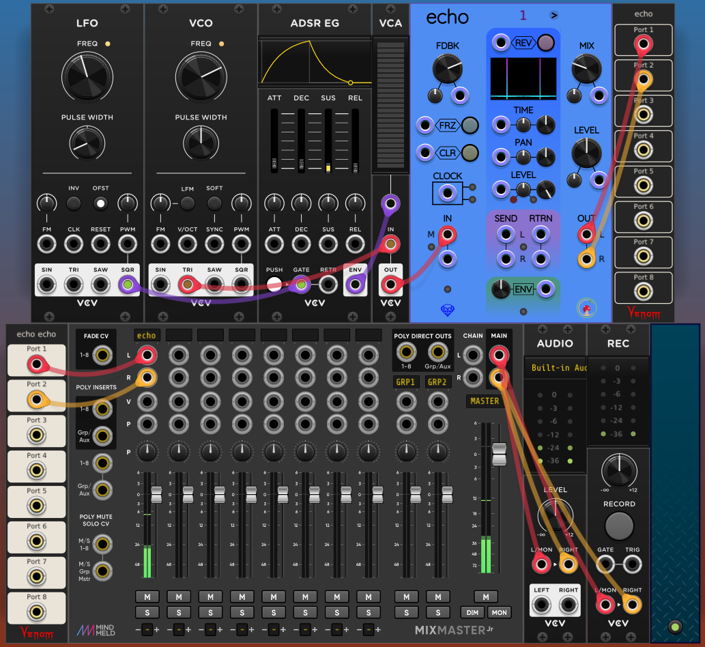

# Sapphire Echo unit tests

Sapphire Echo is uniquely resistant to "enginizing". Therefore, it is difficult to craft automated unit tests. However, here are some manual unit tests.

To look for problems, open each patch in turn. Check the criteria specified for each patch, and of course, also look for anything weird or wrong.

---

## 1. Graph duration test

Download: [`echo_test_graph_duration.vcv`](echo_test_graph_duration.vcv)

Check that each pulse in the signal graph slides directly upward and disappears exactly as the next pulse begins. The Echo TIME knob is set to 1 second. The VCV LFO is set to 1 Hz.
